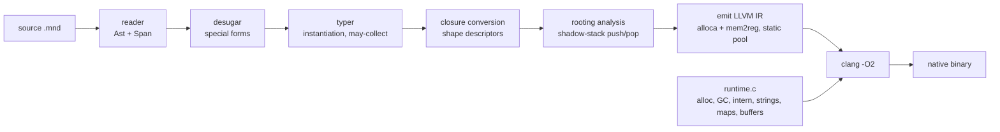
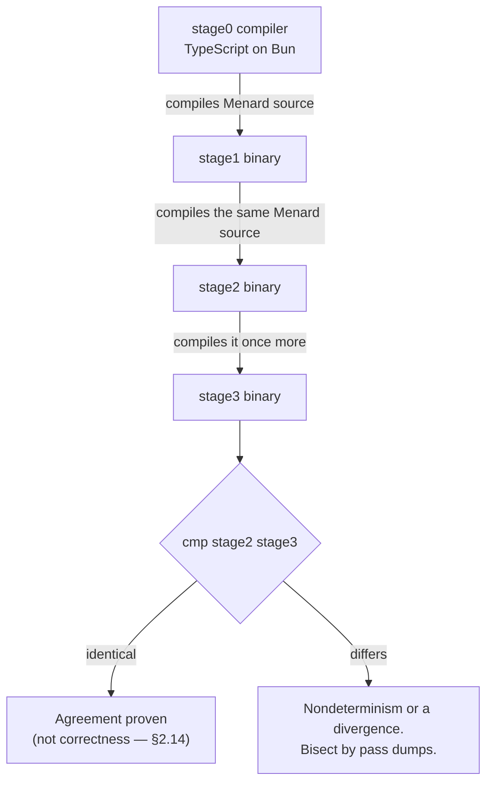

# Menard — Language Specification

A small, statically typed, self-hosting language that compiles to LLVM IR, with
first-class closures, explicit type parameters, and a precise garbage collector.

> *Menard did not want to write another Quixote, which is easy. He wanted to
> write the Quixote: to arrive, by a separate and independent act of authorship,
> at a text word for word identical to Cervantes'.*
> — the argument of Borges' *Pierre Menard, Author of the Quixote*, paraphrased

That is this project's headline criterion. Two independently produced
compilers — one written in TypeScript, one written in Menard — must emit
byte-identical output for the same source. Not the same text by copying, but the
same text by two separate routes.

---

## 0. Executive summary

Menard answers one question: *can a language small enough for one person to
finish express its own compiler, compile to LLVM IR, and still have closures and
a real collector?*

Every decision below trades features for finishability. The design keeps the
**frontend trivial** (s-expressions), the **type system plain** (explicit type
parameters, declared never inferred), the **syntax closed** (no macros, ever),
the **numeric model narrow** (one integer type, one float type), and the
**backend boring** (emit naive IR, let LLVM do the work). The two hard parts —
closure conversion and the collector — are isolated behind narrow interfaces and
deferred to late phases.

The proof of agreement is a single byte-comparison: `stage2 == stage3`.

**§2.14 is a necessary companion to that gate.** It proves that two
implementations *agree*. It does not prove that either is *correct*, and the
difference is not academic: a deterministically wrong compiler passes it every
time.

---

## 1. Project intention

### 1.1 What Menard is

- A **real language**, not a toy: closures, heap data, generic records and
  variants, exhaustive matching, a standard library, diagnostics with source
  spans.
- A **self-hosting compiler**: the Menard compiler is written in Menard and
  compiles itself to LLVM IR.
- A **build tool written in its own language** (`mn`, §2.15): emit IR, invoke the
  C toolchain, link the runtime, produce a binary. The top-level build command is
  Menard code, not a shell script.
- **Finishable by one person.** This is the primary constraint, and it outranks
  every feature request.
- **Not a general-purpose systems language.** If a feature is not required for
  self-hosting, it is out of scope.

### 1.2 Success criteria

All eight must hold, and each is testable.

**Agreement — proven by the bootstrap gate:**

1. The Menard-written compiler compiles itself: `stage2` and `stage3` are
   **byte-identical**.
2. The determinism obligations of §2.11 hold, and are checked in CI rather than
   asserted in prose.
3. The **artifact the Menard driver produces is byte-identical to the artifact
   the test harness produces** for the same source (§2.15). This is the driver's
   end-to-end test, and it exercises the runtime's strings, lists, file I/O,
   argv, exit codes and process spawning in one comparison.

**Correctness — proven by the oracle and the test suite, not by the gate:**

4. The **reference interpreter** (§5, phase 1) agrees with both compiled stages
   on the whole corpus. This is the only evidence of correctness the project
   has, and it is why phase 1 is not optional.
5. Programs using closures, type-parametric records and variants, GC'd heap
   objects, exhaustive `match` and the standard library run correctly.
6. The collector is **precise** (no conservative scanning in the final build)
   and a stress corpus runs in bounded memory.

**Project hygiene:**

7. A clean checkout bootstraps with one command: `make bootstrap`.
8. All parse and type errors report a source span.

### 1.3 Non-goals

Macros (**permanently — see §2.9**), **inferred** generics (Hindley–Milner
inference, let-generalization), higher-kinded type parameters, type classes,
**effect systems**, subtyping, row polymorphism, structural union types, classes
or inheritance, exceptions, concurrency/threads, FFI beyond libc, finalizers,
weak references, incremental compilation, a package manager, a REPL,
self-hosting the runtime, **additional integer types**, **a `Byte` type**,
**unboxed fields**, **general mutable arrays**, **debug text as a value**
(§2.16), **`null`** (§2.10), and **shell-string command execution, `fork`,
signal handling, child timeouts, per-spawn environment or working directory, and
streaming child I/O** (§2.15).

For everything except macros, integer types, byte types, unboxing, mutable
arrays, debug-as-value, null and that last group, these are v2 conversations.
Each is listed specifically because it is an attractive detour that kills
projects like this.

### 1.4 Guiding principle

> Every feature must be payable by one implementer. If a feature doubles backend
> work without being required for self-hosting, it is deferred.

---

## 2. The language

### 2.1 Lexical syntax

S-expressions throughout. `;` begins a line comment. Nothing else: no infix, no
indentation rules, no significant whitespace.

Rationale: a ~250-line reader, zero grammar ambiguity, and a format that is
trivial to generate and parse. S-expressions are **not** chosen for
homoiconicity — see §2.9; that rationale does not hold here.

Source files use the extension **`.mnd`**.

**Casing is enforced, not conventional:**

| Kind | Case | Examples |
|---|---|---|
| Type constructor, variant constructor | **Upper** initial | `Int`, `List`, `Tree`, `(Leaf x)`, `StringBuffer` |
| Value, function, field, module path | **lower** initial | `fst`, `parse-expr`, `map`, `and` |
| Type variable | **lower** initial | `[a]`, `[k v]` |

The check lives in the parser and the typer, not the lexer: whether `Foo` is a
type or a constructor is decided by the form it appears in, and the lexer cannot
know. The rule costs nothing at runtime — types are erased — and it catches
`Int`/`int` transpositions, which are otherwise silent name-resolution errors.
It also makes signatures readable at a glance: lowercase names inside a type
expression are type variables.

**Identifier characters, and the `!` hygiene rule.** `!` is a legal identifier
character — `set!` requires it — but it may appear **only as the final
character**. `sb-append!` is fine; `a!b` is a lexical error. This is hygiene, not
semantics: see §2.15 for the one thing a trailing `!` means.

### 2.2 Values, representation and arithmetic

Every value occupies **one 64-bit word**. Representation is uniform, which is
what makes generic user code, the collector and the emitter all tractable.

| Kind | Shape | Notes |
|---|---|---|
| `Int` | tagged immediate | **63-bit signed** |
| `Bool`, `Char`, `Unit` | tagged immediate | |
| `Float` | `bytes`: header + 8-byte f64 payload | boxed; **static** when a literal |
| `Sym` | pointer to a `bytes` object holding the name bytes | always **static**, interned by name |
| `Str` | `bytes`: header + byte length + bytes | **static** when a literal |
| record | `ordinary`: header + word-sized fields | heap |
| variant | `ordinary`: header + word-sized payload slots | **header-only when nullary, and then static** |
| `Ref` | `ordinary`: header + one slot | heap |
| `StringBuffer` | `ordinary`: header + byte-object pointer + length + capacity | heap |
| `Fn` | `closure`: header + code pointer + environment pointer | heap |

#### The representation invariants

Four global invariants hold for every value in every Menard program. They are
what allow the collector to work without per-type field maps (§4.3), so they are
load-bearing rather than conventional:

1. **Every immediate is odd.** The tag bit is the low bit, set for immediates.
2. **Every object is even and 8-byte aligned** — heap objects and static objects
   alike. The allocator returns nothing less aligned than 8, and every static
   object is emitted with `align 8`. A slot may hold either, and the collector's
   "even, non-zero" test must see one as even.
3. **The empty word — 0 — is the only even word that is not the address of an
   object or a function.** Address 0 is never a heap object and never a static
   one, so neither the allocator nor the emitter can produce it. It is **not a
   Menard value**: it is never printed, never compared, never returned by any
   operation, and no Menard program can construct it, observe it, or pass it
   anywhere. See below for what it is *for*.
4. **The only even words a slot may hold are** pointers into the heap, pointers
   to static objects, the empty word, and — in a closure's slot 0 only — a code
   pointer, which the collector skips by layout kind. **Byte payloads are not
   words in slots at all**: they are the bodies of `bytes`-kind objects, and the
   collector never reads them.

Invariants 1–4 are asserted in the heap-verify build. Violating any of them
produces a collector that frees live objects.

#### The empty word

**Menard has no `null`** (§2.10): absence is `(Maybe T)`, `deref` cannot fail,
no operation returns null, and the language therefore has no null-pointer
failure mode at all. So the empty word is **not a reference to anything** —
there is no null object for it to point at. It is the allocator's initialiser
and the collector's classification rule, and calling it "null" invites exactly
the mistake of thinking it is a value.

It exists for one reason, which has nothing to do with language semantics:
**partially-initialised and recycled memory must be safe to trace.**

The mechanism is unavoidable. A freshly allocated object is filled **field by
field**, and filling a field may itself allocate — `(cons (leaf 1) (leaf 2))`
allocates the two leaves before it has finished the cons. So the collector can
run while an object has unwritten slots. Without a distinguished word, those
slots hold whatever was in that memory before: a **stale pointer** into a freed
object, or an **even non-pointer** such as a code pointer. Either is traced, and
either fails **silently and deterministically in both stages** — precisely
§2.14's blind spot, and precisely the class of bug the gate cannot see.

With the empty word, the worst case is a wasted read.

**But the sentinel is not load-bearing.** The property that actually matters is
stronger:

> **No published object ever contains the empty word.** An object's slots are all
> written before it can be reached by the collector — by a root, or by another
> reachable object.

That is an **emitter obligation and an allocator obligation**, and it is
**asserted in heap-verify** (§3.7, §4.3) rather than assumed. Both layers are
deliberate, because they cover each other's failure: **without the assertion, a
violation of the discipline is silent corruption; with the assertion alone, a
violation is loud.** The word converts a potential pointer-tracing bug into a
wasted read; the assertion is what prevents the collector from *depending* on
that. The word is therefore a backstop, not the mechanism.

#### 2.2.1 Objects: layout kind, location, and the static pool

Every object — heap or static — begins with a **shape pointer** to a static
descriptor. The descriptor holds the nominal type id, the **constructor tag**,
the object size, a **layout kind**, and a **location**.

**Layout kind** — how the collector reads the object:

| Kind | Slots | Collector rule |
|---|---|---|
| `ordinary` | word-sized fields | odd → skip; **empty word → skip**; even non-zero → trace |
| `closure` | code pointer, environment pointer, captured words | **skip slot 0**, then as `ordinary` |
| `bytes` | none — the payload is bytes, with the length in the header | scan nothing |

**Location** — where the object lives, an orthogonal bit:

| Location | Rule |
|---|---|
| heap | allocated by `mn_alloc`; traced; swept when unmarked |
| **static** | emitted into the program image, 8-byte aligned; never swept, never marked, never written; **a pointer to one is a leaf** |

**Two axes, not one.** Layout and location are independent questions, and an
enumeration that tried to answer both at once could not express the objects this
design needs. An interned symbol name is a `bytes` object that is also static —
one axis calls it "not a closure", the other calls it "not in the heap" — and a
`Str` literal is the same pair. The collector therefore asks two questions, each
with a one-line answer, rather than consulting a list of special cases.

**One descriptor per constructor.** The constructor tag lives in the descriptor,
not in the object, so **a nullary variant is header-only** — a single word. This
matters in a way it did not when variants carried an inline tag: for a
constructor with no payload, the tag word would be the object's *only* slot, and
its layout would decide whether the collector scanned it. Removing the word
removes the question, and saves a word on every variant object — which is every
`Ast` node.

**Accepted cost:** one extra load per `match` (header → descriptor → tag), which
LLVM usually hoists or folds. Traded for a word saved on every variant object and
the disappearance of the tag-word layout question.

**`Float` is a `bytes` object.** An f64 payload is arbitrary bits, and arbitrary
bits are very often an even, non-zero word: `1.0` is `0x3FF0000000000000`, `2.0`
is `0x4000000000000000`, `0.5` is `0x3FE0000000000000`. Under `ordinary` layout
each would be traced as a pointer to an object that does not exist — a crash, and
not a rare one. Invariant 4's rule that **byte payloads are not words in slots**
is exactly what makes this safe, and it is the same rule that already covers
`Str` and a `StringBuffer`'s backing store.

**The static pool.** The constants of the program:

- `Str` **literals**;
- `Float` **literals**;
- interned `Sym` names;
- **every nullary variant constructor** — `None`, and each payload-free
  constructor such as `(Empty)`, `(NotFound)`, `(Permission)`.

The last entry is worth stating generally. Because every value is one word and no
operation consults per-type metadata — types are erased — `(Maybe Int)` and
`(Maybe Str)` have identical layout, so **one static `None` serves every
instantiation**. No specialisation, no per-instantiation singletons.

**What the static pool buys is allocation deletion, not GC throughput.** `Str` is
not interned, so without this every *evaluation* of a literal allocates:
`(str-concat "foo" x)` in a loop allocates `"foo"` on every iteration, and a
constructor constant is reallocated every time it is returned — which for `None`
is every failed lookup in `map-get` and `arr-nth`. A compiler's most frequent
allocations are its constants, and static objects remove them entirely.

**Static-ness is invisible to the language.** No operation may distinguish a
static `Str` from a heap one, a literal from a computed value, or a static
nullary constructor from a freshly built one. There is no address comparison, no
`is-static`, and none may be added: the moment static-ness is observable it
becomes a semantic difference and a new way for the two stages to disagree. This
invisibility is also what makes deduplication safe.

**Deduplication and emission order are canonical.** Static objects are
**deduplicated by byte content** and **emitted sorted by byte content**. Both are
emitted bytes and therefore determinism obligations (§2.11): if one stage
deduplicated literals and the other did not, their IR would differ and the gate
would fail with no compiler bug behind it. Sorting is chosen because it is total,
cheap, and shrinks the image.

**Not in the descriptor: a GC field map.** With user type parameters (§2.3) a
static field map cannot exist — `Leaf` in a `(Tree Str)` holds a pointer the
collector must trace, and `Leaf` in a `(Tree Int)` holds an immediate it must
not. The collector decides by slot content and layout kind (§4.3), which is why
invariants 1–4 above are invariants.

**A pointer to a shape descriptor serves three purposes at once:** `match` gets
its tag, layout has exactly one source of truth, and the collector learns what to
skip and whether the object is its business.

**Fence.** No static object holds word slots. Everything in the static pool is
`bytes`-kind or a header-only `ordinary`, so the rule is satisfied by
construction. If a static object with word slots is ever wanted, the invariant *a
static object's slots hold only immediates, the empty word, or other static
objects* becomes required, and must be asserted in heap-verify.

#### Why `Int` is 63 bits, and why there is only one integer type

- **The machine word is already 64-bit.** Nothing needs "forcing" in the
  backend. The real question is how many of those 64 bits the *language's* `Int`
  may use.
- **The tag bit does three jobs.** It discriminates immediates from pointers for
  `match`, for generic user code, and — decisively — for the collector. It is not
  a spare bit.
- **A narrower `Int` buys nothing.** In this representation, `add` is one
  instruction regardless of nominal width. There is no performance argument for
  `Int32` in the *backend*; it would not be faster, only narrower. (The TS host
  is a different story — see §3.9 — but stage0's speed is a developer-iteration
  cost, not a correctness property.)
- **A wider `Int` costs real money.** A full 64-bit value cannot sit beside a
  tag, so it requires either boxing (an allocation per arithmetic operation, and
  GC pressure) or abandoning the uniform representation — and abandoning it would
  break the invariants above, taking the collector's mechanism with it.
- **One integer type.** Providing `Int32` *and* `Int64` would force explicit
  conversions everywhere (there are no implicit conversions), duplicate the
  arithmetic paths in the typer and the emitter, and — most seriously — create a
  **second axis on which stage0 and the backend can disagree**, doubling the
  class of fixed-point bugs.
- **Integer width and float boxing are one decision, not two.** The alternative
  to a tag bit is NaN-boxing, which unboxes `Float` but leaves only ~48 bits of
  payload — making `Int` *narrower*, not wider. For a compiler, integer width is
  worth more than float speed. Hence: 63-bit `Int`, boxed `Float`.
- **The same argument forbids a `Byte` type** (§2.3). A byte is a second integer
  type with the same conversion noise and the same second agreement axis, and
  the runtime pays for it in the typer, the predicates, the derive engine and
  both stages — even though it would be free in the *representation*, since it
  fits the tag exactly as `Int` does. Being precise about where the cost lands
  is the point: representation-free, surface-expensive.

#### Arithmetic: which operations are free

The language's `Int` is arithmetic **modulo 2^63**, values written signed in
`[-2^62, 2^62 − 1]`. Overflow wraps; it never traps. The backend's tagged form is
`t(v) = (v << 1) | 1` held in an `i64`.

**`+` and `−` are free.** Both identities are exact in the tagged domain:

```
t(a) + t(b) − 1  ==  t(a + b)
t(a) − t(b) + 1  ==  t(a − b)
```

The tagged add is a plain `add i64` with no masking and no untagging. Note *why*
it works: `t` maps `Z/2⁶³` bijectively onto the odd residues mod `2⁶⁴`, and
odd + odd − 1 is odd, so the tagged result stays in the image. The wraparound
that appears is the machine's, and it is the wraparound the language specifies.

**Nothing else is free.** In particular, **multiplying two tagged words is
wrong.** `t(a)·t(b) = 4ab + 2a + 2b + 1`, which equals `2ab + 1` only when
`ab + a + b ≡ 0 (mod 2⁶³)` — true by accident on small operands, false in
general. A naive tagged multiply passes casual testing and fails on larger
values, and because it fails *identically in both stages* it **passes the
bootstrap gate**. This is the single most dangerous arithmetic mistake available
in this design; see §2.14.

**The rule for every other operation** (`*`, `/`, `%`, `<<`, `>>`):

1. **untag** each operand — arithmetic shift right by 1;
2. perform the **native 64-bit operation**;
3. **reduce to 63 bits** (the same operation `BigInt.asIntN(63, …)` performs —
   sign-extend from bit 62);
4. **retag**.

No 128-bit intermediate is needed, and the reason is worth stating because the
obvious objection is wrong. The exact product of two 63-bit values needs up to
126 bits, but the *language* never asks for the exact product — it asks for the
product **mod 2^63**, which is determined entirely by the low bits, and those fit
in 64. Concretely: `mul i64` on the untagged operands yields the product mod
2^64, whose reduction mod 2^63 is exactly the required value, because `2^63`
divides `2^64`.

**Division and remainder are specified, not inherited.** They are **truncated
toward zero**, with the remainder taking the sign of the dividend. Division or
remainder by zero is a defined `panic`, not undefined behaviour — which matters
because LLVM's `sdiv` by zero *is* undefined, so the guard must be emitted
explicitly rather than relied on. The classic hardware trap for `INT64_MIN / −1`
cannot fire, because untagged operands are 63-bit and never reach `INT64_MIN`.
Both stages implement this same convention; the TypeScript host's `bigint`
division already truncates toward zero, so the two agree by default — but the
agreement is required, not assumed.

**Shifts are total.** The shift amount is taken as an unsigned 63-bit quantity;
if it is ≥ 63 the result is defined rather than undefined — `<<` yields 0, and
arithmetic `>>` yields 0 or −1 according to the sign of the left operand. This
rule is trivial to implement identically in both stages, which is the point.

#### The host must not model the tag

The tag is a **backend representation detail**. The host (stage0 and the
reference interpreter) models `Int` as an **untagged** bigint reduced to 63
bits, and never constructs, inspects or reasons about a tagged word. Applying
`BigInt.asIntN(63, …)` to a *tagged* value is a silent width bug; applying it to
an untagged value is correct. Keeping the tag out of the host entirely removes
the opportunity.

**Accepted costs:** `Int` range is 63-bit signed; `Float` is boxed; **fields are
never unboxed**. All three are acceptable because Menard is a self-hosting
language, not a systems language.

### 2.3 Types

Primitives: `Int Float Bool Char Str Sym Unit`.

Built-in compounds: `(List T)` `(Map K V)` `(Maybe T)` `(Result T E)` `(Ref T)`
`(Arr T n)`.

Built-in reference type: `StringBuffer` (§2.8.2).

Nominal types, **with explicit type parameters**:

```lisp
(defrec (Pair [a b]) (fst: a) (snd: b))

(variant (Tree [a])
  (Leaf a)
  (Node (Tree a) (Tree a))
  (Empty))

(defrec (Env [v]) (parent: (Maybe (Env v))) (bindings: (Map Str v)))
```

Rules:

- **Type parameters are declared with `[a]` in the declaration and applied with
  `(Name T …)`. Square brackets declare; round brackets apply.** This keeps the
  two readable at a glance and avoids the ambiguity of `(Tree a)` meaning both.
- **Parameters are declared, never inferred.** No let-generalization, no
  Hindley–Milner. A definition states its parameters; a *use site* needs no
  annotation and is solved by unification against the declared scheme.
- **Parameters range over types, not type constructors.** `[a]` is a type; there
  is no `[f]` that could be applied to an argument. No higher-kinded parameters.
- **No type classes, no ad-hoc overloading, no effect system.** `show`, the
  canonical order and equality are derived by the compiler (§2.12), never
  supplied by the user.
- **No subtyping and no row polymorphism.** A record's field set is exactly what
  it declares.
- Signatures on top-level `defn` are mandatory; `let` bindings and lambda
  parameters infer locally.
- **No implicit conversions, no truthiness.** Conditions are `Bool`, always.
- `match` is exhaustiveness-checked. **Guarded arms do not count as coverage**
  and are documented as such.
- **Duplicate keys overwrite; last write wins.** Iteration order at the language
  level is defined **only through the derived canonical order** (§2.11.O), and
  `map-keys` / `map-entries` return that order — so no Menard program can ever
  observe hash order. See the persistence rule below.
- **`(Map K V)` requires `K` orderable** (§2.12). This is stronger than "keys
  must be orderable to *show* the map", and deliberately so: it means a
  non-orderable key can never make iteration nondeterministic, and it removes the
  need for a separate equality-and-hash story for `Ref` and `Fn` keys.
- **Strings are raw bytes, and are never normalised.** Equality and order are
  both defined over that byte sequence, and nothing else. Menard performs no
  Unicode normalisation anywhere, at any point, for any purpose. This is a
  correctness rule, not an optimisation: if equality were normalisation-aware
  while order was byte-based, two strings could compare equal yet order
  differently, and map behaviour would depend on the spelling of a key.
- Every `Ast` node carries a `Span` (byte offsets) for diagnostics.

#### Immutability, and the two reference types

Values are immutable. There are exactly **two** exceptions, and they are
enumerated rather than described, because "immutable except X" is only checkable
if `X` is a closed list:

| Type | Semantics | `=` |
|---|---|---|
| `(Ref T)` | one mutable cell; `ref`/`deref`/`set!` | by **identity** |
| `StringBuffer` | a mutable byte buffer (§2.8.2) | by **identity** |

Both are **reference** types: passing one shares the cell, and mutating it
through one name is visible through another. Everything else — including `Map`,
which is the point of the persistence rule below — has **value** semantics.

Neither is **showable** nor **orderable**, which is what keeps mutable state out
of emitted output (§2.11.I). Both are **equatable**, by identity. Their contents
*are* inspectable while debugging, through a separate printer that cannot reach
output — §2.16.

#### `Str` is bytes; `Char` is a scalar value

Three clarifications that make byte-level I/O well defined:

- **A `Str` need not be valid UTF-8.** It is an arbitrary byte sequence; UTF-8
  is a *convention the library interprets*, never an invariant the type carries
  or the reader enforces. `read-file` can return anything, and the reader must
  be able to represent what it reads. (Consequence: `show` of a `Str` may itself
  produce invalid UTF-8, since it escapes only `\` and `"`.) **It may also
  contain NUL bytes**, which has one hard consequence at the OS boundary — see
  §2.15, where a NUL in an argument is an error rather than a truncation.
- **`Char` is a Unicode *scalar value*** — a code point excluding the surrogate
  range `U+D800–U+DFFF`. This makes `char->str` **total** and never failing,
  while `str-chars` (decode) is the **fallible** direction.
- **There is no `Byte` type.** Bytes are `Int`s in a documented `0..255` range,
  reached through `str-byte`. The compiler's byte-critical paths — reader,
  hashing, I/O — are exactly the paths where a range assertion is a test. If
  readability is wanted, `(alias Byte Int)` is free: nullary and transparent, so
  it guarantees nothing, but the display view (§2.3) will show `Byte` in
  diagnostics.
- **The reader is byte-oriented and never uses `Char`.** A `Char`-oriented
  reader could not represent invalid UTF-8, and would compute byte offsets
  wrongly on non-ASCII source — which would break spans, and spans are how every
  diagnostic is reported.

A `Str` **literal** is a static object rather than a heap allocation (§2.2.1).
The type is unchanged and the distinction is unobservable; it is a property of
where the bytes live.

#### The persistence rule for `Map`

`Map` is a **value**, in the same sense as `List`. That is not free, and it is
the one place where the runtime must do real data-structure work.

`map-set` cannot mutate in place. If it did, then

```lisp
(let a (map-new))
(let b a)
(map-set a "k" 1)     ; b would also change
```

would silently alias, and the language's central promise would be false for
exactly the data type the *compiler itself* uses most. Two honest options:

- **Structurally-shared persistent map** (HAMT or equivalent) in the runtime,
  giving `O(log n)` updates with value semantics. **This is the specification.**
  Costed in §7, and it is implemented twice (§2.15 note).
- **Escape hatch, free of charge:** because `Ref` exists, the *prelude* can
  implement mutable scope chains as association lists behind a `Ref` when a
  program wants O(1) extension and does not care about persistence. The compiler
  may well do this for its own environment chains.

What is **not** permissible is leaving `Map` with reference semantics and calling
the language immutable. That is precisely the kind of "deterministic,
both-stages-agree, and wrong" defect §2.14 warns about: the compiler would
bootstrap perfectly while aliasing its own symbol tables.

#### Type aliases

```lisp
(alias Ints (List Int))
(alias Env  (Map Str Binding))
(alias Pass (Fn (Ast Env) -> Ast))
```

An alias introduces **no new type** — only a spelling for an existing one.

| Rule | Why |
|---|---|
| **Fully transparent.** `(alias A B)` is exactly `B`. | Otherwise it would be a nominal type, and user nominal types are declared only via `defrec`/`variant`. |
| **Nullary — no parameters.** | An alias with parameters is a type-level lambda, and that is a type-level function, which is out. `(alias IntTree (Tree Int))` is fine. |
| **Cycles are errors.** `(alias T T)` is rejected. Recursion through a nominal type is fine. | Eager expansion would diverge otherwise. |
| **Expanded before every semantic check**, including the showable/orderable/equatable predicates (§2.12) and type identity. | A predicate must not be able to disagree with itself depending on how a type was spelled. |
| **Never affects `show` output** (§2.13), which prints the underlying nominal name. | If an alias changed printed output, the two stages would differ whenever they spelled a type differently — a fixed-point failure caused by a *convenience* feature. |
| **Mangling uses the expanded type** (§2.7). | Two identical types under different aliases must mangle identically, or symbols duplicate or go missing. |

**Two views of every type.** The single rule that makes aliases safe is that a
type has a *canonical* face and a *display* face:

- **Canonical** — fully expanded, alias-free. Used for type identity,
  unification, mangling, the §2.12 predicates, the derive engine, and everything
  emitted. This is what keeps the fixed point safe.
- **Display** — retains alias names. Used **only** in compiler diagnostics.
  Never compared, never emitted.

The display rule is deliberately the cheapest deterministic one available:
**report the spelling the programmer wrote in the annotation, expanding one
level at a time as the diagnostic moves inward, preferring the current module's
own aliases.** It derives from source text rather than from a choice among
candidate aliases, so there is nothing to break a tie over.

Diagnostics are human-facing and outside the fixed point — the same line §2.14
draws — but they must still be *deterministic*, because §3.7's negative type
tests compare messages byte-for-byte. Hence a fixed rule rather than an ad-hoc
choice.

### 2.4 Control flow

**Everything is an expression.** `if`, `match` and `loop` yield values; only
`while` and `do` exist purely for effect.

```lisp
(defn sign (n: Int) -> Str
  (if (< n 0) "negative"
    (if (= n 0) "zero" "positive")))

(defn sum-to (n: Int) -> Int
  (loop ((i 0) (acc 0))
    (if (> i n)
      acc
      (recur (+ i 1) (+ acc i)))))

(defn (tree-size [a]) (t: (Tree a)) -> Int
  (match t
    (Empty)       0
    (Leaf _)      1
    (Node l r)    (+ 1 (+ (tree-size l) (tree-size r)))))

(defn count-down (n: Int) -> Unit
  (let i (ref n))
  (while (> (deref i) 0)
    (print (deref i))
    (set! i (- (deref i) 1))))

(match (parse src)                      ; no exceptions: this is the error path
  (Ok ast) (emit ast)
  (Err e)  (print-error e)))
```

| Construct | Semantics | LLVM lowering |
|---|---|---|
| `let` | sequential bindings (`let*`-like) | `alloca` + `mem2reg` |
| `do` | sequence, yields last | straight-line stores |
| `if` | expression, `Bool` only | `br` + alloca, promoted to `phi` |
| `and` / `or` | short-circuit | `br` per operand |
| `loop` / `recur` | tail iteration, guaranteed TCO | basic blocks + `musttail` |
| `while` | `Ref`-based sugar, yields `Unit` | same as `loop` |
| `match` | decision tree, exhaustive | `switch` on the descriptor's constructor tag; pointer compares for nullary cases; compares for `Str` |
| `return` | early exit | `br` to unified exit block |
| `panic` | terminal | runtime call + `unreachable` |

**No `break`, no `continue`.** `recur` is `continue`; not recurring is `break`;
`return` escapes. Two concepts instead of four.

**No exceptions** has a large backend payoff: no `invoke`, no landing pads, no
unwind tables, no personality function. Every call is a plain `call`.

`match` patterns supported: variant, literal (`Int`/`Str`/`Sym`), binding,
wildcard, nested, or-patterns, and `when` guards.

### 2.5 The complete special-form set

Because there are no macros (§2.9), **every piece of sugar lives in the
compiler**. This list is the whole language, and it is closed:

```
defn  defrec  variant  alias  import  pub  extern
let   do      if       and     or      cond    when
loop  recur   while    match   return  panic
ref   deref   set!     quote
```

`cond`, `when`, `while` and `and`/`or` are sugar over `if` and `loop`, expanded
during desugaring (before typing).

Note what is **not** here: `show`, `print`, `=`, `compare` and `dump` are
**compiler-known intrinsics** (§2.8.1), not special forms, because they are
type-directed rather than syntactic. **No process or OS operation is a special
form either** — `spawn` is an ordinary function over the host seam (§2.15).

**The trailing `!` is not a special form.** It is a naming convention with one
defined meaning (§2.15), it appears in no type, and the compiler does not check
it.

### 2.6 Closures

Standard closure conversion: every `fn` becomes a top-level function taking a
hidden environment pointer; free variables are copied into a heap environment
record at closure creation.

```lisp
(defn adder (n: Int) -> (Fn (Int) -> Int)
  (fn (m) (+ n m)))
```

lowers to roughly:

```
adder_impl:
  %env = call ptr @mn_alloc(i64 16, ptr @shape_fn1)
  store i64 %n, ptr %env, 8
  %clo = call ptr @mn_alloc(i64 24, ptr @shape_closure)
  store ptr @adder_lam0, ptr %clo, 8     ; slot 0 = code. layout = closure
  store ptr %env,        ptr %clo, 16    ; slot 1 = environment (traced)
  ret ptr %clo

adder_lam0(ptr %env, i64 %m) -> i64:
  %n = load i64, ptr %env, 8
  ret i64 (add i64 %n, i64 %m)
```

**Slot 0 is a code pointer, and it is even.** The collector does not trace it —
the closure's layout kind tells it to skip slot 0 (§2.2.1). A collector that
trusted the tag bit alone would mark a `.text` address as a heap object.

**Immutability makes capture a copy** — no mutable cells, no synchronisation.
Mutation goes through `(Ref T)` or a `StringBuffer` (§2.8.2): capture the
reference by value, mutate the cell behind it.

`let rec` requires knot-tying: allocate the environment, then patch in the
self-reference.

No currying. Functions take a flat argument list.

**A polymorphic function is compiled once.** Because every value is one word
(§2.2) and the collector does not consult static per-type metadata (§4.3), a
`(defn (length [a]) …)` has **one** compiled body, shared by every
instantiation. Instantiation is a typechecker concern only — see §3.3 and §7.

### 2.7 Modules, exports and foreign functions

- One file = one module, explicit `import`, **no import cycles**.
- **`extern` binds a C symbol.** The declared name *is* the link-time symbol, so
  it must be a legal C identifier: no `!`, no `-`. Higher-level names live on
  ordinary Menard wrappers (§2.15).
- Mangled symbol names: `mn_<modulehash>_<name>`, with a stable hash of the
  module path so unrelated modules cannot collide. The hash is a fixed constant
  algorithm with **no per-run seed** (§2.11). Type names never mangle — types are
  erased — and where a mangled name must encode a type (a derived function,
  §2.12) it uses the **expanded** type, never an alias.

**Exports are explicit: private by default, `pub` to publish.**

| Declaration | Exportable? | Notes |
|---|---|---|
| `defn`, `defrec`, `variant` | yes, with `pub` | The module's interface |
| `alias` | yes, with `pub` | See below |
| `extern` | **no** | C symbols are an implementation detail; wrap them |
| Derived functions (`show`, `=`, `compare`, `dump`) | **n/a — always internal** | Compiler-generated, not module API; always linkable so they work across modules |

The reason to publish an alias is not correctness — aliases are transparent, so
an importer can always write the expansion. It is that a public alias is the
module's **vocabulary**: the word importers are entitled to use in their own
signatures, and to see in their own error messages (§2.3).

One rule that saves a confusing error: **a `pub` signature may not mention a
private nominal type.** Otherwise importers get a function they cannot name a
type for and therefore cannot call. (The alternative — an abstract type, usable
only as an opaque value — is a coherent feature, and a v2 conversation. It is
**not** needed for anything in §2.8.2: `Map` and `StringBuffer` are built-in
nominal types, which the typer knows directly.)

**And `extern` is confined to the seam's modules** (§2.15): `stdlib/sys.mnd`,
`io.mnd`, `fs.mnd`, `proc.mnd`, and the runtime's own headers. That confinement
is the marker of the ambient boundary (§2.11.B), and it is *checkable*, where a
naming convention would not be.

### 2.8 The surface: four tiers

Menard's operations come from four places, and the placement rule is the whole
story of "what belongs in the compiler":

| Tier | Rule | Implemented | In this specification? |
|---|---|---|---|
| **§2.8.1 Compiler-known intrinsics** | Needs **per-type synthesis** | Twice: stage0 and the Menard compiler | **Yes** — these are language |
| **§2.8.2 Runtime-backed built-ins** | Needs in-place mutation or an opaque C representation | Twice: the C runtime and the interpreter | **Yes** — signatures and semantics |
| **§2.8.3 Prelude** | Expressible in Menard | **Once** — one source, compiled by both stages | Listed only |
| **§2.15 Host seam** | Touches the OS | Twice: `libc` and the interpreter's host API | **Yes** — mechanism, floor, error taxonomy |

The principle behind it: **whatever is implemented twice belongs in the
specification.** Stage0 and the Menard compiler each implement the typer, the
derive engine and the emitter, so those are specified in detail. A prelude
function is written once, so the gate already covers it and prose would only go
stale.

The second row's rule has a second clause: an operation belongs there when it
needs in-place mutation **and** the compiler itself is a client that needs it in
a hot path. That is not an open door — it is a criterion with a named client,
which is why the tier stays as small as it is. Note that **everything in the
seam is `extern`-backed and therefore *outside* Menard's type theory**: the
seam's cost is that it is a second implementation, not that it enlarges the
language.

#### 2.8.1 Compiler-known intrinsics

The set is **five operations**. Membership is decided by a single criterion:
these are exactly the operations that require the **derive engine** —
type-directed synthesis over the shape of a type — because the mechanism cannot
be reified in the language (it must inspect values the type system calls opaque)
and cannot be written in the prelude.

```lisp
(defn (show    [a]) (v: a)        -> Str   ; requires showable a  (§2.12)
(defn (print   [a]) (v: a)        -> Unit  ; show, then write to fd 1
(defn (=       [a]) (x: a) (y: a) -> Bool  ; total (§2.12); identity for Ref/Fn/buffers
(defn (compare [a]) (x: a) (y: a) -> Int   ; requires orderable a; <0, 0, >0
(defn (dump    [a]) (v: a)        -> Unit  ; loose debug text, fd 2 only (§2.16); no predicate
```

`show`, `=`, `compare` and `dump` are **derived per type**: records
field-by-field in declaration order, variants by tag then payload, lists in index
order, maps by sorted keys. They are the *third* traversal machinery in the
compiler, distinct from both the typer and the emitter, and they are
**parametrised** (§2.8.4). `dump` is the same traversal with a **loose**
policy — it is not a second engine (§2.16).

The type-directed operations must agree with the representation about static
objects in exactly one respect: a static `Str` and an equal heap `Str` are
indistinguishable to `show`, `=` and `compare` (§2.2.1). They compare on bytes
and never on address, so this is satisfied by construction — and it is the reason
the static pool can be deduplicated.

Everything a reader might expect here and does not find — `length`, `map`,
`fold`, `sort`, `contains`, `append` — is expressible with `match` and `recur`,
so it lives in the prelude.

**None of the five carries a `!`** (§2.15). Two of them touch a stream, but a
stream is not a value you hold, so their effect is not *mutation* — which is the
only thing `!` marks. `show`, `=` and `compare` are pure and touch nothing.

#### 2.8.2 Runtime-backed built-ins

These need either in-place mutation or an opaque representation, so they cannot
be written in Menard at acceptable cost. They are **declared** to the typer as
built-in nominal types with fixed operations, and implemented in the runtime:

```lisp
; Str and Char — byte-level and scalar-level access (§2.3)
(str-byte-length) (s: Str) -> Int
(str-byte)        (s: Str) (i: Int) -> Int          ; 0..255
(str-slice)       (s: Str) (start: Int) (len: Int) -> Str
(str-concat)      (a: Str) (b: Str) -> Str
(char->str)       (c: Char) -> Str                  ; total
(str-chars)       (s: Str) -> (Result (List Char) Int)  ; Int = byte offset of first bad byte

; Arr — fixed-size, immutable (no in-place update, so no growth)
(arr-new)    [a]    (n: Int) (v: a) -> (Arr a n)
(arr-length) [a n]  (xs: (Arr a n)) -> Int
(arr-nth)    [a n]  (xs: (Arr a n)) (i: Int) -> (Maybe a)

; Map — persistent, value semantics, keys orderable (§2.3)
(map-new)     [k v] () -> (Map k v)
(map-get)     [k v] (m: (Map k v)) (k2: k) -> (Maybe v)
(map-set)     [k v] (m: (Map k v)) (k2: k) (v2: v) -> (Map k v)
(map-has)     [k v] (m: (Map k v)) (k2: k) -> Bool
(map-size)    [k v] (m: (Map k v)) -> Int
(map-keys)    [k v] (m: (Map k v)) -> (List k)          ; canonical order (§2.11.O)
(map-entries) [k v] (m: (Map k v)) -> (List k) (List v) ; parallel lists, same order

; StringBuffer — a reference type with in-place append (§2.3)
(sb-new)          () -> StringBuffer
(sb-append!)      (sb: StringBuffer) (s: Str) -> Unit      ; ! — visible mutation
(sb-append-byte!) (sb: StringBuffer) (b: Int) -> Unit      ; ! — 0..255
(sb-length)       (sb: StringBuffer) -> Int                ; bytes
(sb-clear!)       (sb: StringBuffer) -> Unit               ; ! — visible mutation
(sb-to-str)       (sb: StringBuffer) -> Str                ; non-destructive, cached
(sb-take-str!)    (sb: StringBuffer) -> Str                ; ! — transfers storage; buffer becomes empty
```

**Note which of these carry `!`,** because it is the cleanest illustration of the
rule in §2.15: the four that change state a caller can still observe do, and
`sb-to-str` does not, because it is non-destructive. That distinction is the one
a reader most needs — *who owns the backing store?* — and it is exactly the
distinction a single blanket marker would destroy.

Three deliberate choices among the maps:

- **`map-keys` and `map-entries` return the derived canonical order**, not hash
  order. That makes map iteration deterministic *by construction*, which is
  worth an `O(k log k)` sort on every call. It also means **the hash function
  needs no cross-stage agreement**: the hash order is never observable, so
  stage0's JS `Map` and the runtime's C table may differ freely. That is a whole
  agreement axis removed by §2.11.O.
- **`map-entries` returns two parallel lists**, not a list of pairs, so that the
  built-in surface does not depend on a prelude type. `(List (Pair k v))` is a
  fine prelude function over it.
- **`Arr` is immutable and fixed-size**, so it has no growth operation. A
  growable byte buffer therefore does not appear as an array operation; it is
  `StringBuffer`, below.

#### `StringBuffer`: why it is built in

A mutable string buffer could be written in the prelude — a `Ref` to a chunk
list, joined once at the end. That is linear time, it passes the gate, and it is
correct. It is a built-in anyway, for three reasons in order of importance:

1. **`sb-take-str!` is `O(1)`, always.** `Str` and the buffer's backing store
   share one representation (layout kind `bytes`, §2.2.1), so transferring
   ownership is a pointer move, not a copy. This saves the largest single
   allocation the compiler makes.
2. **`sb-to-str` is `O(1)` on repeat.** It caches, so converting the same buffer
   twice does not re-join.
3. **Append allocates no cons cell.** A prelude buffer over a chunk list
   allocates one cons per append, which is the dominant cost under a
   bump-allocating nursery and the hottest allocation site in the compiler.

So the built-in buys constants and one avoided copy, not asymptotic safety. It
is on this tier because the *compiler is the client* and the emitter is its hot
loop; that is the criterion, and it is the same criterion that admits `Map`.

**It does not require an abstract or `extern`-backed type.** A **built-in
nominal type** — the same treatment `Map` receives — needs no new language
feature at all: the typer knows the type, the operations live in the runtime, and
nothing about it is abstract. The cost is a few hundred lines implemented twice
(§7), which is the same class of cost as `Map`; and since `Map` was admitted to
this tier *precisely* because it needs in-place mutation, consistency requires
the same verdict here.

**Semantics, stated precisely**, because it is implemented twice:

- **Reference semantics**, like `Ref`. Two names for one buffer observe each
  other's mutations.
- **Append is amortised `O(1)`**; the backing store doubles on demand.
- **The backing store is always heap-owned and writable.** A `StringBuffer` never
  adopts the payload of a static object (§2.2.1); `.rodata` is never written.
  Every `Str` a buffer hands out either shares heap storage — which forces a copy
  before the next in-place write — or is itself freshly allocated.
- **`sb-take-str!` transfers** the backing store and leaves the buffer
  **empty and valid**. It is *not* an affine/consume operation, and there is no
  use-after-finish hazard: the buffer remains a working, empty buffer. Aliases
  observe it empty, which is the same observation `sb-clear!` produces.
- **Copy-on-write after a non-destructive `sb-to-str`.** Because a `Str` handed
  out by `sb-to-str` *shares* the backing store, the buffer's **next append must
  copy before writing in place**. Without this rule an append would mutate an
  immutable `Str` that a caller already holds — a silent corruption, invisible to
  the gate. `sb-take-str!` has no such constraint, because it hands over
  ownership. Note that the cache `sb-to-str` maintains is **invisible** to the
  caller, which is why it is not mutation in the §2.15 sense and why it carries
  no `!`.
- **Not showable, not orderable, equatable by identity** (§2.12). A mutable
  value has no stable spelling, so showing one is banned; and that ban is a
  compile error, which is what keeps a buffer out of emitted bytes (§2.11.I).
  Its contents remain inspectable while debugging: `(dump sb)` and
  `(sb-to-str sb)`, §2.16.

**Why not a general `MutBytes` instead** — a mutable byte array as the built-in,
with `StringBuffer`, growth and `to-str` all in the prelude on top? It is a
*smaller and more general* primitive, and it would also unlock efficient growable
arrays. It is rejected because it opens a **general mutation door** — every
operation on any array becomes a candidate output-path hazard — rather than one
purpose-built cell whose predicates (§2.12) are non-showable and non-orderable by
construction. Generality here costs more discipline than it saves in lines. It
remains the v2 option if growable arrays are ever wanted.

**And the floor is met without any of this.** A compiler can simply stream chunks
to stdout with `write` (§2.15), needing no buffer at all — the OS buffers.
`StringBuffer` is an optimisation for programs that assemble before writing,
which the emitter does.

#### 2.8.3 The prelude

The prelude is ordinary Menard, ~1,500 lines, and it is where everything
expressible in the language goes: **all list operations** (`length`, `nth`,
`append`, `reverse`, `take`, `drop`, `map`, `filter`, `fold`, `zip`, `contains`,
`sort`), string and character helpers, `parse`, combinators, `map-entries` →
pairs, `sb-append-show!`, and the compiler itself. It is itself a substantial
test of the language.

**`sort` takes no comparator.** It uses the derived canonical order — with
`compare` if a Menard-level comparator is wanted internally, but there is no
caller-supplied predicate anywhere in an output path (§2.11.O).

```lisp
;; expressible, so prelude rather than built-in. Carries ! because it mutates its argument.
(defn (sb-append-show! [a]) (sb: StringBuffer) (v: a) -> Unit
  (sb-append! sb (show v)))                ; requires showable a
```

Two more prelude members earn a mention because §2.15 depends on them:

```lisp
;; Explicit, visible, testable PATH search — the primitive does NOT do this (§2.15).
(defn (find-on-path) (name: Str) -> (Maybe Str)
  ... reads (getenv "PATH") and probes candidate paths ...)

;; A process status as an exit code, folding signal death the way a shell does.
(defn (status->exit-code) (s: SpawnStatus) -> Int
  (match s
    (Exited n)    n
    (Signalled n) (+ 128 n)))
```

Neither carries a `!`: `find-on-path` reads the environment and returns a value
without changing anything a caller holds, and `status->exit-code` is pure.
`find-on-path` is the honest form of a rule this specification holds elsewhere:
the ambient lookup lives **in the program** where it can be read, tested and
diffed — not inside a runtime primitive where it is invisible.

#### 2.8.4 Instantiation and the derive engine

**Instantiation.** "Declared, not inferred" removes *inference*. It does not
remove instantiation: to type `(map f xs)` where
`map : (Fn (Fn (a) -> b)) -> (List a) -> (List b)`, the checker must solve for
`a` and `b` at the use site. This is unification of a declared scheme against
argument types — finite, local, and needing no generalization step. Crucially it
is a **typer-only** cost: the backend compiles each polymorphic body **once**
(§2.6), so there is no monomorphization, no code duplication, and no
compile-time blow-up. Uniform one-word values plus a tag-based collector are what
make that free — and they are also what let a nullary constructor be shared
across instantiations (§2.2.1).

**The derive engine** synthesizes `show`, `=`, `compare` and `dump` per-type,
memoised, recursive over the type DAG. It is **parametrised**: `show` for a
`(Tree a)` needs `show` for `a`, so a derived function for a polymorphic type is
generated per instantiation, and derived functions are mutually recursive. It is
written twice — once in TypeScript, once in Menard — and the two must agree byte
for byte. Two consequences:

- The **showable**, **orderable** and **equatable** predicates (§2.12) are
  checked at *instantiation sites*: `(Tree Int)` may be showable while
  `(Tree (Ref Int))` is not. `dump` has **no predicate** (§2.16).
- Derived functions are generated code, and generated code may be specialised
  per instantiation for free — they call `show_Int` directly rather than routing
  through a runtime type check. This is where the small per-instantiation code
  generation budget goes, and it is bounded by the set of instantiations the
  program actually uses.

A derived function must also be **static-blind**: it compares and prints on
structure and bytes, never on address, so a deduplicated static literal is
indistinguishable from a heap `Str` (§2.2.1).

**Accepted cost:** with no macros and no inferred generics, the prelude will
contain duplication that a more expressive language would factor out. Take the
duplication. It is cheaper than either feature.

### 2.9 Extensibility: deliberately closed

Menard has no macros and no user-defined syntax, now or in future.

Rationale: macros impose a cognitive burden on **every reader of every program**
written in the language, forever. The alternative — a fixed set of special forms
in the compiler — pays that cost *per idiom that is added*, in two compilers.
For a language whose purpose is to be finished and understood, that is the right
trade.

**The cost is paid per idiom, not once, and that should be stated plainly.**
Every new control-flow idiom — `unless`, `with-*`, `let*`, anything — is either a
new special form, which forces a full three-stage re-bootstrap to verify, or
hand-duplication in the prelude. Macros are precisely the mechanism that lets a
language absorb such idioms without touching the compiler, and banning them
inverts that economics. The ban is kept anyway, because the cost is paid by
*implementers* in compiler time while the benefit accrues to *every reader
forever*.

Consequences, all accepted:

- **The special-form list (§2.5) is the extension mechanism.** Adding sugar
  means changing the compiler, in both stages, and re-bootstrapping.
- **Homoiconicity is absent.** S-expressions are retained because they give a
  cheap, unambiguous reader and a trivial printer — not for code-as-data
  manipulation. Nothing in the design depends on quoted code. `quote` survives
  only for data literals.
- **The prelude cannot add syntax**, so library code is more repetitive (§2.8.3).
- **Diagnostics are generic.** A fixed form set funnels every error through the
  same machinery; there is no macro layer in which to give a construct a bespoke
  message. Accepted as a developer-velocity cost.
- **A reader of Menard knows the entire syntax.** This is the benefit, and it is
  the point.

### 2.10 Semantics notes

- **Values are immutable**, except the two reference types `(Ref T)` and
  `StringBuffer` (§2.3). `Map` obeys immutability by persistence, which is a
  runtime obligation, not a convention.
- **Evaluation order is left-to-right**, specified, because determinism matters
  for the fixed point.
- **Integer arithmetic wraps at 63 bits**; the operation-by-operation rules are
  in §2.2.
- **Whether a value is static or heap-allocated is not observable.** `Str` and
  `Float` literals, interned `Sym`s and nullary constructors are static objects
  (§2.2.1); everything else is heap-allocated. No operation can tell the
  difference, and none may be added that does.
- **Every nullary variant constructor is a constant**, including `None` and
  every payload-free constructor of a user variant. It is not reallocated when
  it is returned.
- **There is no `null`, and there is no null-pointer failure mode.** Absence is
  `(Maybe T)`; `deref` cannot fail; no operation returns a null value; nothing
  needs a null check. The collector's **empty word** (§2.2) is a representation
  sentinel, not a value: it cannot be written, read, printed or compared by any
  Menard program. The distinction is the point — a language can have a
  distinguished word in its heap representation without having that word in its
  semantics.
- **A Menard program may run other programs, but only as a list of arguments**
  (§2.15). There is no shell, no `fork`, and no way to express "run this string".
- **Naming convention:** a trailing `!` marks **observable mutation**, and
  nothing else (§2.15). Talking to the operating system does not qualify, because
  a stream is not a value you hold.
- Output is deterministic (§2.11).

### 2.11 Determinism

The gate `stage2 == stage3` requires **four independent properties**, and each
one fails silently and independently. Two further obligations, weaker and
differently shaped, cover the I/O boundary and internal seeds.

| # | Obligation | Fails when |
|---|---|---|
| **O** | **Order** | Any traversal reaching output iterates in hash/insertion order |
| **I** | **Identity** | An address, allocation index, or intern slot index reaches output |
| **T** | **Text** | `Float` or `Str` has more than one spelling for the same value |
| **A** | **Arithmetic** | The two implementations compute different values (§2.2) |

#### 2.11.O — Order

Maps are unordered at the language level (§2.3). Determinism therefore belongs to
**traversal**, not to the container — but the compiler must be able to traverse
*any* structure deterministically, without the caller having to remember to say
how.

Menard has no typeclasses, and output paths take **no caller-supplied
predicate**. Instead:

- **Structural derivation.** `show`, and the canonical order used by all output
  paths, are derived from the *shape of a type*: records field-by-field in
  declaration order, variants by tag then payload, lists and arrays in index
  order, and maps by a **total order on their keys**.
- **One canonical order, no overrides**, in anything that reaches emitted
  output. A caller-supplied predicate is deliberately not offered: it would be
  viral, silently omittable, and would let stage0 and stage2 disagree. §2.14
  argues why relocating the discipline to call sites is strictly worse.
- **The static pool has one canonical order.** Static objects are deduplicated by
  byte content and emitted sorted by byte content (§2.2.1), so the image does not
  depend on the order in which the compiler happened to encounter literals. Both
  stages must do this identically.
- **Printing is not the only consumer.** Diagnostics, symbol emission, cache
  keys and test comparisons all need a deterministic order. Attaching
  determinism to the *type* covers all of them; a call-site predicate covers only
  the sites you remembered.
- **A map ordered "as a value" is ordered by its sorted entries.** The order on a
  map *value*, when one is needed — for example when a map is itself a key in an
  outer map (§2.12) — is **lexicographic over its entries sorted by key**. It is
  *content-derived*, never iteration-derived. This is consistent with maps having
  no language-level iteration order: the order belongs to the value's structure,
  not to how it was built.
- **`map-keys` and `map-entries` hand out that same order** (§2.8.2), which is
  what makes map iteration deterministic for *user* code as well as for the
  compiler. This is the rule that removes the hash function from the agreement
  surface: hash order is unobservable, so stage0 and the runtime need not agree
  on it.

#### 2.11.I — Identity

No run-dependent identity may reach output. Concretely, the following must never
appear in anything emitted, in any form, including in error messages that are
themselves compared:

- heap addresses, pointer values, or allocation indices — and equally the
  **address of a static object**, whose placement, deduplication and emission
  order are canonical instead (§2.2.1);
- intern table slot indices (symbols are identified by *name*);
- iteration positions in a hash table;
- anything derived from a hash table's internal layout;
- the identity of a `Ref` or a `StringBuffer` (§2.3) — neither is showable, so
  neither can be printed as a value in any position that reaches emitted bytes;
- **whether any `Str`, `Float` or nullary constructor is static or heap** — the
  distinction is invisible to the language, so it must not be visible in its
  output either;
- **alias names in any position that affects emitted bytes** (§2.3) — aliases
  live in the display view and nowhere else;
- **the absolute path of any file** — including a source file, a runtime object,
  or a toolchain program. Paths in the IR derive from the module path *as the
  user gave it*, never from a resolved absolute path (§2.15).

This obligation governs **emitted bytes**, which is a narrower set than "anything
ever written out". §2.16 defines a debug printer whose output goes to stderr and
which may therefore contain addresses; that output is not an emitted byte and is
excluded from every comparison. The distinction is the whole reason §2.16 exists,
and the rule that preserves it is that debug text has **no way to become a
value**.

The only identities permitted in output are **names and indices defined by the
program itself**. Where a derived or instantiated name must encode a type, it
encodes the **expanded** type (§2.7).

This is enforced by types, not by discipline: see §2.12 for the *showable*
predicate, and §2.16 for the isolation of debug-only printing.

#### 2.11.T — Text

Every value that is shown must have **exactly one spelling**. The normative
rules are in §2.13. In particular:

- `Float` is shown in a **single canonical shortest-round-trip decimal form**,
  and the spelling depends only on the bit pattern.
- **NaN is not a value in Menard.** Float arithmetic that would produce NaN or
  an infinity (including float division by zero) is a defined `panic`, not a
  silently propagated non-value. This removes the largest source of
  non-canonical float text.
- `−0.0` and `0.0` are distinct bit patterns and print distinctly; the rule is
  fixed rather than left to the formatter.
- `Str` is shown with a fixed, minimal escaping, is never normalised, and need
  not be valid UTF-8 (§2.3).

#### 2.11.A — Arithmetic

The width and the operation semantics of §2.2 hold **identically** in stage0, in
the reference interpreter, and in the self-hosted backend. A mismatch here only
ever surfaces on overflow or on a specific operand pattern, which makes it a late
and baffling failure — and, if it is deterministic, an *invisible* one (§2.14).
Overflow-adjacent arithmetic gets its own corpus (§3.7).

#### 2.11.B — Boundary

A fifth obligation, weaker and differently shaped from the other four. Menard
programs may read the OS (§2.15): files, streams, environment, arguments, and
child processes. Those values enter the program from outside, so two runs are
comparable only when the outside is **held fixed**. The rule is about reaching
output, not about avoiding input:

> **Ambient state may enter a program. It may never reach emitted bytes unless it
> entered through an argument the fixed point also supplies.**

Practically: the gate runs both stages in the same environment with the same
inputs (§3.6), the compiler emits no path, no timestamp, no locale-dependent text
and no `strerror` string (§2.15), and the interpreter can run against a virtual
filesystem so that corpus tests are hermetic (§2.15).

**This obligation is governed by a structural marker rather than a naming one.**
Everything it applies to is an `extern`-backed wrapper confined to
`stdlib/sys.mnd`, `io.mnd`, `fs.mnd` and `proc.mnd` (§2.15), so the boundary is
visible to the compiler and to a lint.

**The spawning case is the clearest instance of this rule.** A child process
inherits the environment and the working directory, so a child's behaviour is
ambient — but the *compiler's IR* is not, because IR emission never consults a
child. The driver's success depends on the toolchain; the artifact does not. That
asymmetry is what makes §2.15's `spawn` safe for the fixed point.

#### 2.11.S — Seeds

For completeness, since hashing is used internally: every hash seed is a **fixed
constant** in the source, never derived from time, pid, address, environment, or
randomness. The compiler is single-threaded. No timestamps, build IDs, absolute
paths, or locale-dependent formatting may reach output. These are belt-and-braces
rules: obligation **O** means internal hash layout should never be observable in
the first place, but a fixed seed means that if some traversal is ever missed by
O, the failure is a caught divergence rather than an intermittent one.

**Payoff:** because determinism comes from the type rather than from the
container, **`Map` may be implemented in any way at all** — a plain hash table
internally, with no insertion-order bookkeeping, provided the *value* semantics
of §2.3 are honoured. The constraint lives in one place (the derived order), not
at every emission site.

### 2.12 Three predicates: showable, orderable, equatable

There are **three** predicates, and they have different shapes:

| Predicate | Question | Used by |
|---|---|---|
| **Showable(T)** | Does T have exactly one spelling? | `show`, `print`, map keys when shown |
| **Orderable(T)** | Is there a total order consistent with equality? | `compare`, `sort`, `Map` **keys**, canonical emission |
| **Equatable(T)** | Is equality defined on T? | `=`, `contains` |

All three are **positive, recursive predicates over types** — not lists of
exclusions — because a reader must be able to decide the question for an
arbitrary type without reconstructing the rule. All three are evaluated on
**expanded** types (§2.3) and at **instantiation sites** (§2.8.4): a
parameterised type satisfies a predicate exactly when its instantiation does.

**Orderable(T)** — a total order consistent with equality:

| Type | Orderable? | Order |
|---|---|---|
| `Int`, `Bool`, `Char` | yes | numeric / scalar value |
| `Unit` | yes | trivial |
| `Str` | yes | raw bytes, lexicographic, no normalisation |
| `Sym` | yes | **by name, byte-wise** — never by address or slot index |
| `Float` | **no** | see below |
| `Ref`, `StringBuffer` | **no** | mutable, identity-bearing, hence run-dependent |
| record | if all fields orderable | lexicographic, declaration order |
| variant | if all payloads orderable | constructor tag, then payload |
| `(List T)`, `(Arr T n)` | if `T` orderable | lexicographic, then length |
| `(Maybe T)`, `(Result T E)` | if components orderable | constructor tag, then payload |
| `(Map K V)` | if `K` and `V` orderable | **lexicographic over entries sorted by `K`** (§2.11.O) |
| user nominal type with parameters | if the instantiation is | per the above rules |

**Showable(T)** — has exactly one spelling:

The same table, with two changes: `Float` **is** showable (canonical text,
§2.13), and `(Map K V)` requires `K` *orderable* and `V` *showable* — because
showing a map means emitting its entries in sorted order, which needs an order on
the keys, not merely a spelling. `StringBuffer` is not showable, and neither is
`Ref`.

**Why `Ref` and `StringBuffer` are not showable.** For both types, **the value
*is* the identity**; the contents are other values. So `show` could not be a
function of the value:

- Two distinct buffers holding identical bytes are distinct values that would
  print identically, breaking §2.13's requirement that the text be injective
  over a value's bits.
- Any contents-based order would be inconsistent with the equality §2.12 defines
  for them (identity), so they cannot be orderable either.
- And showability **composes**: a showable buffer makes every record, list and
  map containing one showable, so a buffer's *current contents* could reach an
  emitted byte several files away from the mistake. `sb-take-str!` and
  `sb-to-str` cross that boundary explicitly and are greppable; `show` would be
  silent.

The need that motivates the question — *I want to see the buffer while
debugging* — is real, and it is met by §2.16, which is a **different printer with
a different contract**: loose, stderr-only, unable to become a value, and
therefore unable to reach the artifact.

**Equatable(T)** — equality is defined on **every** type, which is why this is a
third predicate and not a subset of the other two. For orderable types it is
**consistency-required**: `x = y` exactly when `compare x y = 0`. For the rest:

- `(Ref T)` — **identity**: two refs are equal when they are the same cell.
- `StringBuffer` — **identity**: same buffer.
- `(Fn …)` — **identity**: same code pointer and same environment pointer.
- records, variants, lists, maps — structural, component-wise.

Equality on `Ref`, `StringBuffer` and `Fn` is identity-based, and that is *safe*,
because its result is a `Bool` and never a printed address. What is forbidden is
the identity reaching output — which is why these types are non-showable, not
non-equatable. `contains` on a list of refs is therefore legal and deterministic.

**No predicate can see static-ness.** A `Str` literal that has been deduplicated
against another occurrence compares equal to a heap-computed `Str` with the same
bytes, because `Str` equality and order are defined on bytes (§2.3). A static
nullary constructor compares equal to itself and distinct from its siblings, on
the descriptor's tag. Nothing in this section changes, and nothing may be added
that would.

`Ref`, `StringBuffer` and `Fn` are **neither orderable nor showable**. This is
what prevents the most dangerous version of the identity leak: a record such as
`{ name: Str, owner: (Ref T) }` nested inside an emitted list would otherwise
print a heap address, two runs would intern at different addresses, and
`stage2 != stage3` — with the defect occurring nowhere near the gate that catches
it.

**Float is unorderable by choice.** A total order on floats is possible once NaN
is excluded (§2.11.T), so this is a deliberate exclusion rather than a forced
consequence: float keys are a trap (equality semantics, `−0.0`, the distinction
between a key that is epsilon-equal and one that is bit-equal), and no part of a
compiler ever wants to key a map by a float.

**Ties and consistency.** The order must be *total on distinct values*, because
ties reintroduce nondeterminism. Two rules secure this:

1. Every orderable type is compared on a representation whose equality is the
   same equivalence — which is why `Str` equality and `Str` order are both
   defined over unnormalised bytes, and why `Sym` is compared by name rather than
   by the identity of its intern slot.
2. `Float` is excluded, which removes the only primitive whose equality is
   coarser than any sane order.

**Termination.** The predicates are structural over a finite type DAG (recursive
types are permitted; the type graph is finite and its cycles are nominal).
Derivation is **memoised per instantiated type name**, never inline-unrolled, so
`(Tree Int)` derives once rather than diverging. `(Map (Map (Str Int) Bool) V)`
is a legal key type, and the inner map's order is its sorted-entry lexicographic
order.

**Errors are at the point of use.** A non-orderable key in a map, and a
non-showable value passed to an emission path, are **compile errors**, not
runtime traps. Because `(Map K V)` requires `K` orderable (§2.3), the first of
those is really a rule about `map-new` and `map-set`.

### 2.13 Canonical text forms (normative)

Two implementations must produce identical bytes. These rules are therefore
normative rather than a description of a formatter. **Aliases never appear here**
(§2.3): a record is shown by its declared nominal name. Neither does **static
placement**: a deduplicated literal and a heap `Str` with the same bytes have the
same spelling, because the spelling is defined on bytes alone.

| Value | Spelling |
|---|---|
| `Int` | decimal, signed, no leading `+`, no padding |
| `Bool` | `true` / `false` |
| `Unit` | `()` |
| `Char` | the scalar value in decimal |
| `Str` | `"` … `"`, with `\` and `"` backslash-escaped and nothing else escaped; non-ASCII bytes emitted raw |
| `Sym` | `'` followed by the name bytes, unescaped |
| `Float` | shortest decimal string that round-trips to the same bit pattern, in a single fixed style; `−0.0` distinct from `0.0` |
| record | `(Name f1 f2 …)` in declaration order |
| variant | `(Con payload…)` |
| `(List T)` / `(Arr T n)` | `[e1 e2 …]` |
| `(Map K V)` | `{k1 v1 k2 v2 …}` in sorted key order |
| `(Maybe T)` / `(Result T E)` | `(Some v)` / `(None)` / `(Ok v)` / `(Err e)` |
| `Ref`, `StringBuffer`, `Fn` | **no spelling — a compile error to show** (§2.12). Debug output is a separate contract: §2.16 |

The exact punctuation is a detail and may be revised; what is **not** revisable
is that both stages implement the *same* table, and that the table is total and
injective over the bits of a value. The shortest-round-trip rule for `Float` is
singled out because it is the one entry most likely to differ between an
implementation using the host's native formatting and one using a hand-written
formatter.

### 2.14 What the bootstrap gate proves, and what it does not

`stage2 == stage3` is the project's headline criterion, and it is worth being
precise about its power.

**It proves agreement.** Two compilers, one written in TypeScript and one written
in Menard, independently produce byte-identical output for the same input. This
is strong evidence for all four determinism obligations (§2.11) and for the
fidelity of the self-host.

**It does not prove correctness.** The gate is blind to any bug that is
**deterministic and present in both implementations**. A `*` that is wrong the
same way twice, a type checker that accepts the wrong program, a collector that
frees a live object in a reproducible pattern, a `Map` that aliases instead of
persisting (§2.3), an unwritten slot traced as a pointer (§2.2) — all pass, every
time. The gate compares two implementations; it cannot compare either to the
truth.

§2.2 supplies a concrete instance: a naive multiply of two tagged words is
natural to write, wrong, and **perfectly deterministic**. It passes the gate and
produces wrong numbers forever. A `Float` box given `ordinary` layout is the same
shape of error — the two stages would scan f64 bits identically and corrupt
identically, and the comparison would never see it.

Consequences, and they are structural rather than cosmetic:

- **Correctness evidence lives elsewhere**: the reference interpreter (§5,
  phase 1), the semantic test suite, and review. The gate is an *agreement*
  oracle, not a *correctness* oracle. §1.2 separates the two deliberately.
- **Phase 1 is load-bearing**, not a nice-to-have. It is the only artefact in the
  project whose job is to be *right* rather than to *agree*.
- **Deterministic-wrong needs its own test discipline.** Ordinary differential
  testing cannot catch it, by construction. What catches it is boundary-value
  corpora (overflow, division, shift edges, aliasing) checked against the oracle,
  and readable, reviewed emission code.

**Derived order versus call-site predicates.** Output paths do not take a
caller-supplied ordering predicate, and the reason is that a predicate does not
remove the hard part — it *relocates* it. Every call site still needs a total
order, now each written separately, and the audited discipline moves from "did
you sort at all?" — which the derived design removes entirely — to "did every
site sort with the *same* total order?", which is strictly harder and has no
central definition to check against. Inconsistent orders are as fatal to the
fixed point as absent ones. The derived design converts an unbounded per-site
discipline into a bounded, central, per-type definition. The one legitimate
residual use of a caller-supplied order is human-facing display, which is outside
the fixed point and stays there.

### 2.15 The host seam

A self-hosting compiler cannot be written without an OS interface: it reads
source, writes IR, takes flags from `argv` and sets an exit code. So this surface
is on the critical path to phase 3, not a phase-5 nicety — **the compiler is the
first client.**

#### Marking: `!` for mutation, `extern` for the OS

Two different things need to be visible in source, and they get two different
markers rather than one shared one.

**`!` marks observable mutation.** Precisely:

> `!` marks a call that changes state the caller can still observe afterwards:
> mutation of a value reachable from an argument. *Observable* is the operative
> word — memoisation the caller cannot see does not qualify (`sb-to-str`), and
> neither does talking to the operating system, because a stream is not a value
> you hold.

This is the convention's classic meaning: Scheme's `!` is mutation (`set!`,
`set-car!`, `string-set!`), and there is no `display!` or `read-char!` in Scheme.
Extending it to cover *purity* would be a gesture at an effect system — the
feature §1.3 excludes — and the gesture could not be completed, because the
convention does not propagate: a function calling `print` is not itself marked,
so a reader of a call to that function would learn nothing.

**The consequence is that `!` is rare, and every use of it means the same
thing.**

| Operation | `!`? | Why |
|---|---|---|
| `set!` | **yes** | The anchor case |
| `sb-append!`, `sb-append-byte!`, `sb-clear!`, `sb-take-str!` | **yes** | The buffer is visible through the argument |
| `sb-to-str` | **no** | Non-destructive — the sharp distinction from `sb-take-str!` |
| `print`, `write`, `dump`, `read-file`, `write-file`, `exit`, `spawn`, … | **no** | They touch the OS, not an argument |

The total population of `!` in the language is therefore **one special form and
four functions**. Applying the rule is a decision about five names, not a
judgement call on every I/O call — which matters, because the rule is not
checked. The compiler *could* check the direct case — a `set!` writing to a
parameter slot — but the transitive case is propagation ("this calls something
that mutates its argument"), and propagation is an effect system. So it stays a
convention, and the mitigation is its size.

Neither `panic` nor `exit` carries `!`: the program stopping is not mutation of a
value reachable from an argument.

**The OS boundary is marked by `extern`.** Every ambient operation is an
`extern`-backed wrapper, and `extern` bindings are confined to `stdlib/sys.mnd`,
`io.mnd`, `fs.mnd` and `proc.mnd` (§2.7). So the boundary is **structural and
enforceable**: a module cannot reach `write(2)` without importing the module that
declares it, and a CI lint can refuse an `extern` — or an import of those four —
anywhere else.

One thing is given up, and it should be stated plainly: one-glyph greppability
for "can touch the outside world". The replacement is a grep for `extern`, or
better a lint, and the audit is *stronger*, because imports and externs are
checked by a tool while a naming convention is checked by nobody.

**Why only mutation, and not ambient writes?** Because marking ambient *writes*
alone would be backwards for this project. The fixed point's hazard is an *input*
reaching an output — a `read-file` is the live threat, and a `write-file` is how
the compiler does its job. Marking writes and not reads is exactly the wrong way
round, and marking both is the conflation this rule removes.

**Why not a naming prefix** (`io-print`, `sys-write`)? Visual noise on a large
fraction of the compiler's statements, when the module boundary already carries
the same information in a form the compiler checks.

#### The surface, in tiers

**Tier 0 — the bootstrap floor.** All a self-hosting compiler needs. Note what is
*absent*: no directory listing (imports use explicit relative paths), no
environment, no process spawning, no stdin.

```lisp
; menard/sys.mnd
(exit)      (code: Int) -> Unit
(arg-count) () -> Int
(arg)       (i: Int) -> Str

; menard/io.mnd — fd 1 and 2
(write)     (fd: Int) (s: Str) -> (Result Unit IoError)   ; raw bytes, no escaping
(print)     [a] (v: a) -> Unit                            ; show, then write to fd 1 (§2.8.1)
(dump)      [a] (v: a) -> Unit                            ; loose debug text, fd 2 only (§2.16)

; menard/fs.mnd — whole-file is the primitive; streaming is v2
(read-file)  (path: Str) -> (Result Str IoError)
(write-file) (path: Str) (data: Str) -> (Result Unit IoError)
```

**Tier 1 — the utility surface.**

```lisp
(getenv)      (name: Str) -> (Maybe Str)                  ; §2.11.B: may not reach output
(read-stdin)  () -> (Result Str IoError)
(list-dir)    (path: Str) -> (Result (List Str) IoError)  ; canonical order (§2.11.O)
(exists)      (path: Str) -> Bool
(append-file) (path: Str) (data: Str) -> (Result Unit IoError)
(remove)      (path: Str) -> (Result Unit IoError)
(rename)      (from: Str) (to: Str) -> (Result Unit IoError)
```

**Tier 1½ — process spawning.** Two functions, specified in the next
subsection.

**Tier 2 — v2, not in this language.** Streaming *child* I/O, child timeouts,
`kill`, signal handling, per-spawn working directory or environment, sockets,
time, threads, a general `chdir!`. And two things refused **permanently**, not
deferred:

- **Shell-string execution** (`system`-style, "run this string"). Never.
- **`fork`.** Never, for the reason in the next subsection.

#### Process spawning: argv, not a shell

A self-hosting language whose top-level build command is a shell script has moved
its own integration test *out* of the language. The driver exercises lists,
strings, file I/O, `Result`, exit codes and the whole seam; that is a program
which should be written in the language it ships, and it is a better test of the
runtime than any corpus file.

The distinction that matters is not *whether* a child process starts. It is
**what the caller writes**:

| Form | The caller writes | Verdict |
|---|---|---|
| Shell string | `"cc -O2 -o out out.ll"` | **Refused, permanently** |
| **argv vector** | `(list cc "-O2" "-o" out ir)` | **Admitted** |

A shell string is unbounded ambient state in one string: the shell does word
splitting, quoting, globbing, variable expansion, command substitution and `PATH`
lookup, and none of it is visible in the Menard source or controllable by a test.
The argv form has **already been split by the caller**, so there is no re-parsing
step and nothing to inject. This is not merely "less dangerous than `system`" —
for a build it is *the safer design*, because the argument list is data the
compiler can see, type-check, print and diff. The strongest argument against
exec-ing is an argument against the **string** form.

```lisp
; menard/proc.mnd
(spawn)         (argv: (List Str)) -> (Result SpawnStatus SpawnError)
(spawn-capture) (argv: (List Str)) (stdin: Str) -> (Result SpawnOutput SpawnError)

(variant SpawnStatus
  (Exited Int))       ; the child's own exit code, 0..255 on POSIX
  (Signalled Int))    ; v1 reports signal death; it never acts on it

(defrec SpawnOutput (status: SpawnStatus) (stdout: Str) (stderr: Str))

(variant SpawnError
  (NotFound) (NotExecutable) (Permission)
  (InvalidArgument) (TooManyArguments) (Unsupported))
```

Two forms, and that is the whole surface: one that lets the child use our stdio,
one that pipes it and feeds it a `Str` on stdin. Everything a build needs is
here; everything else is v2. Note that `(NotFound)` and `(Permission)` are
nullary, so they are static singletons (§2.2.1) — the child's failure path
allocates nothing.

Ten rules, each of which must hold identically in the C runtime and in the
interpreter. The first six are the ones that make two implementations agree; the
rest are the ones that keep this from becoming a process-control library.

1. **No shell, ever.** argv is passed through unmodified. There is no string
   form, and there will not be one.
2. **No implicit `PATH` lookup.** `argv[0]` is resolved exactly as the OS
   resolves a path — absolute, or relative to the child's inherited working
   directory. A bare name therefore means *the file `./name`*, not "whatever
   `PATH` says". A caller that wants a `PATH` search calls `(find-on-path)` from
   the prelude (§2.8.3), which reads `PATH` **in visible Menard code**. The rule
   follows the same principle as `dump`'s isolation: ambient influence that
   determines *which program runs* should be written down, not hidden in a
   primitive. It is also what makes the driver's toolchain choice auditable — a
   build system's "which `clang` did I actually get?" is a real class of bug, and
   this design cannot have it.
3. **The child's environment is inherited, and this is a hole the caller owns.**
   `clang` needs `PATH`, `TMPDIR` and so on to function, so inheriting is the
   only workable default. The distinction from rule 2 is the point: the
   environment may affect *how* a known program behaves, but not *which* program
   runs. §2.11.B governs the consequence — a child's behaviour may not reach
   emitted bytes — and it cannot, because IR emission never spawns. Passing an
   explicit environment is v2.
4. **The child's working directory is inherited.** There is no `chdir!` in v1:
   it is a process-global mutation that would make the meaning of every relative
   path depend on where the program had previously been. A per-spawn working
   directory is the right shape and is v2.
5. **A `Str` containing a NUL byte cannot be an argument.** `Str` is arbitrary
   bytes (§2.3) and POSIX argv is NUL-terminated, so this is where the two meet.
   Passing one is `InvalidArgument` — **never silent truncation**, which is the
   failure this rule exists to prevent. This is the only place in the language
   where a `Str` is judged rather than passed through, and it fails loudly.
   Likewise, an empty `argv` is `InvalidArgument`.
6. **Exit statuses are not conflated.** The kernel reports a normal exit and a
   signal death as different things and they are kept apart, because they *are*
   different: a build that treats `SIGSEGV` as "exit 11" reports a crash as a
   status. The shell's `128 + n` folding is **not** adopted by the primitive; a
   driver that wants that convention applies it itself, in Menard, where it is
   visible (`status->exit-code`, §2.8.3). `(exit)` takes its code **truncated to
   8 bits**, identically in both stages.
7. **No `fork`.** This is a garbage-collected runtime, and `fork` copies the heap
   *and the collector's and allocator's state* into the child: a half-filled
   object, a shadow stack that no longer corresponds to the new machine stack, a
   nursery pointer into a copy-on-write region. None of it is safe and none of it
   is needed for a build. `posix_spawn` — which the C runtime uses, and which is
   precisely "a fresh image with a fresh heap" — covers the use case. The
   interpreter cannot usefully fork either, so this rule also happens to be what
   lets the two implementations agree on what a child *is*.
8. **No signals, no timeouts, no streaming.** `Signalled` is *reported* and that
   is all: the parent installs no handlers, forwards nothing, and kills nothing.
   `spawn-capture` takes stdin as a whole `Str` up front. A hung child hangs the
   build, and that is v2's problem. Refusing these is also what keeps this
   surface from growing into a process-control library — each one is a
   plausible-sounding addition that does not serve a compiler.
9. **Errors are a closed Menard variant, never `errno` and never a message.**
   Same discipline as `IoError` below, and for the same reason: the *Menard*
   taxonomy is the contract, and a locale-dependent `strerror` must never reach a
   compared diagnostic.
10. **`Unsupported` is the interpreter's escape hatch.** The interpreter can be
    run with spawning disabled, in which case every call returns
    `(Unsupported)`. That is what makes the hermetic corpus claim (§3.7)
    enforceable rather than aspirational.

**What this does to the fixed point: nothing — and the asymmetry is the reason.**
The compiler's *output* never consults a child. `spawn` is a **driver**
operation: the driver runs the compiler, the compiler emits IR, and IR emission
is a pure function of the source text. So obligations O, I, T and A (§2.11) are
untouched, and §2.11.B's rule does the work: the toolchain may determine whether
the build *succeeds*, never what the compiler *emits*. Two rules do follow:

- **A child must not inherit fd 1 when fd 1 is the artifact.** The driver's
  streaming path (`mn emit`) spawns nothing; a child's stdout and stderr would
  otherwise interleave with emitted IR on the same descriptor. Same class as
  §2.16's "`dump` never goes to fd 1", and checkable the same way — by grep.
- **Child output must never be compared.** Captured `clang` stderr contains paths
  and versions. A diagnostic built from captured child output is not
  deterministic, exactly as a `dump`-derived one is not.

**And the path hazard this creates.** Once a driver hands paths to `clang`, an
absolute path has a route into the artifact: through the IR's `source_filename`
and module identifier, which the compiler emits. Hence the rule in §2.11.I:
**paths in the IR derive from the module path as the user gave it, never from a
resolved absolute path.** The gate supplies the same path to both stages, so this
is deterministic by construction; a build that resolved paths first would not be.

**Cost:** ~160 lines of C, ~150 of TypeScript, and a `SpawnError` taxonomy
implemented twice. It is smaller than `Map` and it is the same kind of work — a
second implementation of a narrow interface.

#### The driver (`mn`)

The client that justifies the whole seam. Written in Menard, shipped with the
compiler, ~350 lines:

```
mn emit  <file.mnd>              ; IR to stdout. Spawns nothing.
mn check <file.mnd>              ; typecheck only, no output
mn build <file.mnd> [-o out]     ; emit IR, spawn cc, link, rename
mn run   <file.mnd> [args…]      ; build, then spawn the binary
```

Its rules, all of which fall out of the subsections above:

- **No shell.** `cc` is invoked with an argv list built in Menard.
- **No `PATH` lookup for `cc` or for the runtime object.** Both come from flags
  (`--cc`, `--runtime`) with build-time defaults recorded by the build. The
  default is a path, not a name, and `mn --print-toolchain` prints what it will
  use — which is the auditability rule 2 exists to make possible.
- **Intermediates go beside the output, never in `TMPDIR`.** `out.ll` and the
  linker's output are built at temporary paths next to `-o`, then `(rename)`d
  into place. `rename` is atomic, so an interrupted or failed build **never
  leaves a stale artifact** — which is what makes it safe to interrupt
  `make bootstrap`, and what stops a later gate run from comparing a half-written
  binary.
- **`mn emit` spawns nothing**, so no child can inherit the descriptor carrying
  the artifact.
- **`mn run` maps the child's status to its own exit code** via
  `(status->exit-code)` (§2.8.3), and then `(exit)`s with it. `Signalled n`
  becomes `128 + n` — the shell convention, adopted *at the driver layer only*,
  in a named prelude function, and never in the primitive.
- **The driver is inside the coupled surface.** If the gate's artifacts are
  produced by the driver, then the driver's `argv` construction, path handling
  and spawn ordering are part of what must be deterministic, and §1.2's third
  success criterion is the test: the driver's artifact must be byte-identical to
  the harness's.

#### `IoError`: a closed Menard variant, never `strerror`

```lisp
(variant IoError
  (NotFound) (Permission) (Exists) (IsADirectory) (NotADirectory)
  (InvalidPath) (TooLarge) (Other Int))     ; Int is a Menard code, never errno
```

Two rules, both load-bearing:

- **No `strerror`, no errno, no OS message text.** `strerror` is locale-dependent,
  and §3.7's negative tests compare messages byte-for-byte. The runtime maps
  `errno` into this variant; stage0 maps Bun's exception `code` into it. The
  *Menard* taxonomy is the contract.
- **This is a fifth agreement obligation (§2.11.B), alongside arithmetic.**
  Stage0 sees a JS exception; the runtime sees `errno`. Both must produce the
  *same* case for the same failure. Interrupted reads are retried rather than
  surfaced; partial writes are looped. Neither host's detail may reach behaviour.

The six nullary cases are static singletons (§2.2.1); `(Other n)` is not, since
it carries a code.

#### Six rules

1. **`print` shows; `write` emits.** `print` derives through `show`, which
   *quotes and escapes* a `Str` (§2.13) — so it cannot write IR; the first byte
   would be a quotation mark. `write` is raw and byte-exact. Since `Str` is
   bytes, a whole IR buffer is a `Str` and one `write` emits it.
2. **stdout and stderr are byte streams.** No newline translation, no encoding
   conversion, no locale — otherwise the gate breaks across platforms. Files are
   opened in binary mode for the same reason.
3. **Paths are raw `Str` bytes, never normalised, and never reach emitted bytes.**
   Diagnostics use paths relative to a root, or prefix-mapped (§3.6).
4. **Nothing ambient reaches emitted bytes** (§2.11.B): no environment value, cwd,
   time, hostname, locale, errno text, or absolute path. The audit is over
   `extern`, not over a name.
5. **Output ordering is deterministic.** `list-dir` returns the canonical order
   (§2.11.O), not the OS's. Buffers are flushed before exit; stdout and stderr
   are separate streams with no interleaving guarantee.
6. **The interpreter implements the same surface, over a virtual filesystem**, so
   corpus tests stay hermetic and byte-comparable (§3.7). This is the second
   implementation of the seam — see the note below.

**The dual-implementation note.** Collectively, §2.8.2 and §2.15 are the parts of
the surface implemented **twice**: the C runtime and the interpreter each must
provide `Map`, `StringBuffer`, the string operations, the OS seam and the two
spawn forms, agreeing exactly. That is the same tax as the frontend, and it is
why the built-in surface is kept as small as the tier rules allow. It is also the
one part of the design where "just add a function" is not cheap.

### 2.16 Debug output

Debugging needs to see inside `Ref`, `Fn` and `StringBuffer` values, which `show`
must refuse (§2.12). So debug output is a **separate printer with a different
contract**, and its isolation is structural rather than conventional.

#### Why a separate printer, rather than relaxing `show`

The reasons `show` is closed to `Ref` and `StringBuffer` are in §2.12, and they
are not pedantry: for both types the value *is* the identity, so a contents-based
`show` would not be a function of the value, would break the injectivity §2.13
requires, would be inconsistent with the identity equality §2.12 defines, and —
because showability composes — would let a buffer's current contents reach an
emitted byte through any container holding one.

Debugging wants the opposite of every one of those properties. So it gets its own
operation rather than a weakened `show`.

#### The operation

```lisp
(defn (dump [a]) (v: a) -> Unit    ; loose structural text to fd 2 (stderr)
```

- **Compiler-known intrinsic** (§2.8.1), because it must inspect values the type
  system calls opaque — and a prelude function cannot reify a `Ref`'s or a
  closure's representation.
- **It is the same traversal as `show`, with a loose policy.** One derive engine,
  one memoisation table, one termination argument; the policy differs. So the cost
  is small (§7), and the two printers cannot drift in the parts they share.
- **No predicate.** Any type is dumpable, including `(Tree (Ref Int))` and
  `(Fn …)`. There is nothing to check because nothing is promised.
- **No `!`,** under the rule in §2.15: it touches a stream, which is not a value
  you hold, so it is not mutation.

Looseness, precisely — `dump` agrees with `show` (§2.13) on every showable value,
and extends it:

| Value | `dump` output |
|---|---|
| `Ref` | `(Ref <contents>)` — dereferenced, **never the address** unless the contents are themselves opaque |
| `StringBuffer` | `(StringBuffer "contents…" N)` — the contents, `show`-escaped, plus byte length |
| `Fn` | `(Fn <symbol-or-address> env=<dump of environment>)` |
| `Sym` | same as `show` |
| anything else | whatever `show` produces |

Two entries deserve comment.

- **The closure's environment is included.** Debugging closure conversion and
  capture (§2.6) is a real, predictable need in this project, and the environment
  is the thing that goes wrong. Dumping it costs nothing.
- **`Fn` names are addresses by default.** Recovering a *symbol* name at runtime
  needs a table the default build does not carry; `--debug-symbols` could emit
  and consult one (v2). Note that an address here is **legal**, because of the
  isolation rule below.

`dump` does **not** report static-ness. A deduplicated literal and an equal heap
`Str` dump identically, because the difference is invisible to the language
(§2.2.1) — and fd 2 is not an excuse to leak it, since the point of the rule is
that no operation may notice.

#### The isolation rule, which is the whole design

> **`dump` writes only to fd 2. Debug text has no way to become a value.**

- There is **no `Debug` type** and **no accessor** that turns debug text back into
  a `Str`. The only consumer of a dump is the fd-2 writer.
- Therefore debug text cannot reach an emitted byte — not by accident, not
  through a container, not through a `show`, not through an alias. Obligation
  **I** (§2.11.I) is untouched.
- The payoff is the property you want when debugging: **a forgotten `dump` cannot
  break the fixed point.** No cleanup pass is needed before a bootstrap run, and a
  debug call left in a hot path costs one write to fd 2 and nothing else. That is
  why `dump` is safe to sprinkle.
- **Consequence, stated because it is unusual:** `dump` output is the only thing
  in the system permitted to be **non-reproducible** — it may contain addresses,
  and it may differ between stage0 and stage2. That is permitted *because* it
  cannot be an emitted byte.
- A **two-step design** — a built-in nominal `Debug` type, so that debug text
  could be passed around and composed — is rejected for v1. It buys composability
  at the cost of a built-in type whose value can leak the moment an accessor is
  added. If programmatic access is ever genuinely wanted, that is the v2 path, and
  it should be introduced with the accessor deliberately chosen rather than by
  accident. §1.3 lists "debug text as a value" as a non-goal.

#### Two kinds of text on stderr, with opposite rules

This is the trap this design introduces, and it is worth its own paragraph
because it is silent:

| | Compiler diagnostics | `dump` output |
|---|---|---|
| Stream | stderr | stderr |
| Deterministic? | **Yes — required** (§3.7 byte-compares messages) | **No** — may contain addresses |
| May be compared in tests? | yes | **never** |

So: **never call `dump` from a diagnostic path**, or the negative tests become
flaky; and **never byte-compare `dump` output** — capture fd 2 instead if a test
genuinely needs to assert on it. The three-mechanism summary is: `show` is the
canonical text in the artifact, diagnostics are deterministic human text beside
the artifact, and `dump` is non-reproducible text that must never be either.

#### Cycles and depth

`show`'s termination argument depends on **immutability**: immutable structures
cannot be cyclic, so structural traversal terminates by construction. `Ref`
breaks exactly that assumption — a `Ref` can be made to point at a structure
containing itself. `dump` therefore needs a **fixed depth cap** (16), printing
`...` on truncation, rather than a visited set. A cap is preferred because it
needs no per-call state, cannot itself diverge on a large cyclic graph, and is
trivially identical in both hosts.

`Ref` is the only mechanism in Menard that makes cycles constructible. Static
objects in particular cannot: they are immutable and their contents are fixed at
compile time. Any change that made cycles constructible in a *showable* type
would move `show` outside the fixed point and make the gate fail intermittently —
which is one more reason the reference-type list is closed (§2.3).

#### Not elided

`dump` calls are **never compiled away**. A `--no-debug` elision is refused
because eliding a call skips **evaluating its argument**, and in a language with
effect-ful calls the argument may have effects — so elision would be a semantic
change, and reasoning about when it is safe is the effect-system question §1.3
rules out. If a call is unwanted, delete it; if it is hot, the call site is cheap
enough.

#### Name

`dump` rather than `print-debug`, deliberately: it is **greppable**. You want to
find every debug call in a codebase, and `dump` cannot be confused with `print`
or `write` in a grep. The name carries no promise about the *format*, which is
unspecified beyond the table above and may change freely.

---

## 3. Implementation strategy

### 3.1 Pipeline



Below the point where IR leaves the compiler, the **driver** (§2.15) takes over:
it writes the IR, spawns the toolchain, links the runtime and renames the result
into place. The compiler proper stops at the IR box.

**Pass ordering constraints** (violating these causes subtle miscompiles):

1. Desugaring and `match` expansion happen **before** typing.
2. Alias expansion happens **before** typing — the typer only ever sees canonical
   types (§2.3). The display view is assembled from recorded source spellings at
   diagnostic time.
3. Closure conversion happens **after** typing.
4. Rooting analysis happens **after** closure conversion — closure conversion is
   what creates the environment pointers that are live across allocations.

The **static pool** (§2.2.1) is built during the final emission pass, since it is
a property of the program image rather than of any source-level structure.

### 3.2 Frontend

Reader, span tracking, tree printing, `--dump-after=<pass>` for every pass. The
dump flag is not a nicety; it is the primary debugging tool for §3.8. The reader
enforces the casing rule and the `!` hygiene rule (§2.1), and works in **bytes**
(§2.3).

The reader is also where `Str` and `Float` literals are first identified as
candidates for the static pool, since it is what knows their bytes (§2.2.1).

### 3.3 Typer

- Local inference for `let` and lambdas; declared signatures at top level.
- **Instantiation, not inference.** Type parameters are declared (§2.3); use
  sites are solved by unification of the declared scheme against argument types.
  No generalization step, no let-polymorphism, and therefore **no value
  restriction problem** — a `let`-bound `(Ref T)` can never become polymorphic,
  because polymorphism only ever enters at a declared top-level `defn`.
- **No pointer maps.** The collector does not consult per-type field maps
  (§4.3), so the typer does not compute them.
- Computes **capture analysis** for closure conversion.
- Computes **may-collect** per function: does this function reach the allocator?
  Functions that don't need no rooting at all — in a compiler, that is most of
  them (reader, matcher, printer).
- Implements the **showable**, **orderable** and **equatable** predicates
  (§2.12) on expanded types, at instantiation sites, rejecting violations at the
  point of use. Including the `Map` key rule and the non-showability of `Ref`,
  `Fn` and `StringBuffer`. `dump` **requires no predicate** (§2.16).
- Records the **display view** of every annotation (§2.3) for diagnostics.
- Enforces export rules (§2.7): a `pub` signature may not mention a private
  nominal type.
- Emits exhaustiveness errors with the missing constructor named.

The typer also assigns each constructor its **layout kind** and, for nullary
constructors, its **static** location (§2.2.1) — the one place these are decided,
so that the emitter and the collector cannot disagree about them.

The typechecker is the largest single component. Budget accordingly.

### 3.4 Backend

- **Emit naive IR; let LLVM optimise.** One `alloca` per local, load/store on
  every access, and let `mem2reg` produce SSA. **Never hand-build phi nodes or
  reason about dominance frontiers** — this single choice removes the largest
  conceptual cliff in LLVM frontends.
- **Compile each polymorphic function exactly once.** No monomorphization, no
  code duplication (§2.6, §2.8.4). The only per-instantiation code generation is
  in the derive engine, which is generated code by construction. A static nullary
  constructor is likewise emitted once, shared by every instantiation.
- **Emit the static pool as LLVM globals**, each with `align 8` and a shape
  pointer to a static descriptor (§2.2.1). Alignment is required by invariant 2:
  a slot may hold one, and the collector's "even, non-zero" test must see it even.
  **Deduplicate by byte content and emit sorted by byte content** — both are
  emitted bytes, so both are determinism obligations (§2.11).
- **The constructor tag is read from the shape descriptor**, so a nullary variant
  is a single header word and `match` switches on the descriptor's tag (or
  compares shape pointers directly for nullary cases).
- Arithmetic emits the rules of §2.2 **literally**: `add`/`sub` on tagged words
  with no mask; every other operation untags, performs the native 64-bit op,
  reduces to 63 bits, and retags. `sdiv`/`srem` are preceded by an explicit zero
  check that panics, because LLVM's behaviour there is undefined, not merely
  unspecified.
- **Evaluate a constructor's fields before allocating it, and store them all
  with no intervening allocation.** This is the *no-partial-publication*
  discipline of §2.2, and it is what keeps the empty word out of published
  objects. Objects are built innermost-first. A static object is exempt because
  it is fully formed at compile time — and, being immutable and fully written,
  it trivially satisfies the rule.
- `switch` for `match` on tags and integer literals; comparison chains for `Str`.
- `musttail` for `recur`.
- C calling convention everywhere; the environment pointer is an ordinary first
  argument inside Menard code.
- **The IR's `source_filename` and module identifier derive from the module path
  as given**, never a resolved absolute path (§2.11.I, §2.15). This is easy to
  get wrong by calling a path-normalising helper "for tidiness", and it is a
  fixed-point failure when you do.
- Opaque pointers (`ptr`). Assume LLVM 17+ and **pin the exact version in the
  build**; record it in `--version` output.

### 3.5 Bootstrap chain



The fixed point is

$$C_2 = C_3$$

byte-identical binaries. This is the standard GCC/Rust three-stage bootstrap, and
it is the project's definition of *agreement*.

**stage0 is the reference semantics.** It must be *correct rather than clever*,
because when stage1 and stage2 disagree, stage0 decides who is wrong. In
particular, stage0's arithmetic must match the runtime's **exactly**, including
the 63-bit width and the operation-by-operation rules of §2.2 — and it must model
`Int` **untagged**, never constructing a tagged word (§2.2). Its static pool must
also be **laid out identically** to the Menard stage's: same deduplication, same
sorted order, same alignment (§2.2.1).

**Who invokes `clang` is a free choice, and the gate does not care.** A shell
driver and the Menard driver `mn` (§2.15) both produce the same artifact from the
same IR, provided both supply the same `argv` and the same environment — so
`make bootstrap` may use whichever is available, and the phase-3 acceptance test
is that they agree (§1.2, criterion 3).

### 3.6 Determinism requirements

The fixed point fails on nondeterminism long before it fails on miscompiles.
These are mandatory from day one, and each maps to an obligation in §2.11:

| Requirement | Obligation |
|---|---|
| Output order is the type's, not the container's. Never emit from a traversal whose order depends on hash layout. | **O** |
| **Static objects are deduplicated by byte content and emitted sorted by byte content** (§2.2.1). | **O**, **I** |
| No addresses, allocation indices, intern slot indices, or hash-table positions in any output, including compared diagnostics. Symbols are identified by name. | **I** |
| `Ref`, `Fn` and `StringBuffer` values never reach output — they are non-showable (§2.12). | **I** |
| Debug text (`dump`) never reaches fd 1 and has no way to become a value (§2.16). | **I** |
| **Alias names never reach emitted bytes**; derived and instantiated names encode the expanded type. | **I** |
| **No absolute paths in the IR** — `source_filename` and module ids derive from the module path as given (§3.4). | **I** |
| **A spawned child never inherits the descriptor carrying the artifact**, and captured child output is never compared (§2.15). | **I**, **B** |
| `argv` lists handed to children are built deterministically, in a fixed order, from flags and inputs. | **I** |
| One spelling per value (§2.13). `Float` shortest-round-trip; NaN impossible; `−0.0` fixed. | **T** |
| Arithmetic is 63-bit and identically defined in stage0, the interpreter, and the backend. | **A** |
| `IoError` and `SpawnError` cases are identical in stage0 and the runtime; no `strerror`, no errno text, no locale. | **B** |
| No environment value, cwd, timestamp, hostname or absolute path reaches emitted bytes. | **B**, **I** |
| The audit for the two rows above is over **`extern` and module imports**, not over a name (§2.15). | **B** |
| `list-dir` and `map-keys` hand out the canonical order, never the OS's or the hash's. | **O** |
| Hash seeds are fixed constants; no RNG, clock, pid, environment, or locale in output. | O, I |
| Symbol and definition emission order is **stable and explicit**. | **O** |
| Instantiation order and derived-function naming are deterministic and identical in both stages. | O, I |
| No absolute paths in output: `-ffile-prefix-map`, `-fdebug-prefix-map`, or no debug info in the compared stages. | **I** |
| No timestamps, no build IDs, no random seeds, no environment-dependent output. | **I** |
| The compiler is **single-threaded**. Parallel emission is a v2 feature and a determinism hazard. | O, I |
| The gate runs both stages in the same environment, with the same arguments and inputs. | **B** |
| The gate compares the **artifact only**; stderr is not part of it. Do not merge the streams. | **I**, **B** |

### 3.7 Testing strategy

| Layer | Method |
|---|---|
| Reader | round-trip print tests, fuzzing; casing and `!`-hygiene fixtures; **invalid-UTF-8 input** |
| Typer | negative tests: every error kind has a fixture, **including alias-aware messages** |
| Type parameters | positive and negative instantiation tests; a non-showable instantiation rejected at the point of use |
| Semantics | **reference interpreter** as oracle (§5, phase 1) |
| Backend | golden IR tests, one per construct |
| Whole compiler | differential IR: stage0 vs stage1 on the entire corpus |
| **Deterministic-wrong** | boundary corpora for overflow, division, remainder, shift edges, **`Map` aliasing**, and **`StringBuffer` copy-on-write**, checked against the oracle (§2.14) |
| **Derive engine** | per-type golden output for `show`, `=` and `compare`, including nested maps, recursive types and **parameterised types at several instantiations** |
| **Static pool** | a static `Str` and an equal heap `Str` are indistinguishable to `show`, `=` and `compare`; deduplication and emission order are golden-tested; a nullary constructor allocates nothing; both stages lay the pool out identically |
| **Representation invariants** | heap-verify asserts odd immediates, 8-byte alignment for heap **and** static objects, empty-word handling, **that every slot word matches its declared layout kind**, and **the no-partial-publication rule** — no object reachable from a root at a collection contains the empty word (§2.2) |
| **`dump`** | output captured on **fd 2** and asserted on **structurally**, never byte-compared; a cyclic `Ref` graph must terminate via the depth cap; a closure's dumped environment shows captured values (§2.16) |
| **Canonical text** | one fixture per entry of the §2.13 table, byte-compared |
| **Buffers** | append after `sb-to-str` leaves the earlier `Str` **unchanged** (copy-on-write); `sb-take-str!` then reuse; growth across many appends; `sb-clear!` then reuse |
| **Process spawning** | a **stub child** (§3.10) that echoes its `argv` and exits with a scripted status: the driver's `argv` construction is asserted **exactly**, the `SpawnStatus` decode is asserted, and every `SpawnError` case has a fixture (missing file, non-executable, a NUL in an argument, empty `argv`). The stub is the *only* child the suite spawns. |
| **Driver** | end-to-end: the artifact `mn build` produces is **byte-identical** to the harness's (§1.2 criterion 3), and `rename` atomicity is tested by killing a build mid-flight and checking no artifact appeared |
| Collector | stress mode: collect on *every* allocation; heap-verify mode |
| **Host seam** | golden fixtures over a **virtual filesystem**, so the corpus is hermetic; `IoError` case mapping tested per failure mode |
| Regression | every bug becomes a corpus file, permanently |

**Differential IR testing is the early-warning system** for *divergence*: before
self-hosting works at all, compare the IR text stage0 and stage1 produce for the
same input. Divergence points at a specific pass, with a small failing case.

**But note its blind spot**, which is the lesson of §2.14: differential IR testing
compares two implementations, so a mistake both make is invisible to it. It must
be paired with the oracle and with boundary-value tests, or the project acquires
a false sense of safety.

**Two test-hygiene rules that §2.15 and §2.16 create, both silent if broken:**

- A test may assert on `dump` output only by capturing fd 2 and checking
  structure, never by comparing bytes — debug text is permitted to differ between
  stages, and a byte-comparison would make the suite flaky in a way that looks
  like a real bug.
- **Spawning and the virtual filesystem do not compose.** A child is a real
  process on the real filesystem; the interpreter's virtual FS does not extend
  into it. So spawning tests are a **separate, explicitly non-hermetic tier**, and
  the hermetic corpus runs with spawn **disabled** — every call returning
  `(Unsupported)` — which is what makes the hermetic claim checkable rather than
  aspirational.

### 3.8 Debugging a self-hosted compiler

Keep stage0 forever. When stage3 misbehaves:

1. Reproduce the failure under stage1.
2. Recompile the failing file with stage0.
3. Diff the pass dumps (`--dump-after=typer`, `--dump-after=ir`) between the two.
4. The first divergent pass is the bug.

Add `dump` calls freely here (§2.16): they cannot affect the artifact, so a
debugging session cannot corrupt the fixed point, and no cleanup is required
before re-running the gate.

**If the two stages do not diverge, this procedure cannot help you** — and that
is the case for every bug in §2.14. Those are debugged against the oracle, not
against the other stage.

**When the bug is in the driver rather than the compiler, the divergence is in
the `argv`.** `mn --print-toolchain` and a `dump` of the constructed argument
list turn a "the build produced nothing" symptom into a diff of two lists, which
is the same technique as the pass dumps one level down.

**When the divergence is in the static pool, the diff is a list of literals.**
Deduplication and emission order are canonical (§2.2.1), so a stage that sorted
differently, or failed to deduplicate, shows up as a reordered or duplicated
block in the IR — the same two-list diff one level down.

Never debug a self-hosted compiler without a working older stage. This is the
single most important operational rule in the project.

### 3.9 Host language: TypeScript on Bun

stage0 **and** the reference interpreter are written in TypeScript, run on Bun,
and written to the portable ECMAScript subset so Node also works. They **share
the reader, AST and printer**, so syntax has exactly one implementation in the
host language and one in Menard.

Seven host-language hazards, each with a rule:

1. **Model `Int` as an untagged bigint, wrapped to 63 bits.** Every Menard
   integer is a `bigint` reduced with `BigInt.asIntN(63, …)` (or an equivalent
   shifted form) — *not* 64. **Never** store a Menard `Int` in a JS `number`.
   This is the single most likely source of a fixed-point failure.
2. **Never model the tag in the host.** The tag `t(v) = (v << 1) | 1` is a
   backend representation detail. Applying `asIntN(63, …)` to a *tagged* value is
   a silent width bug; applying it to an untagged value is correct. The host
   works in untagged values only, which removes the opportunity rather than
   relying on care.
3. **JS bitwise operators are 32-bit.** `&`, `|`, `^`, `<<`, `>>` and `>>>`
   silently truncate to 32 bits, so they are banned everywhere a Menard `Int` may
   flow — not merely banned on `number`. Lint rule, enforced in CI.
4. **JS `number` is IEEE-754 double**, so `Float` semantics come free and
   bit-exact. That is the one place the host is *exactly* right by accident —
   with the caveat that the canonical text form of §2.13 is still the
   implementation's responsibility, since `Number.prototype.toString` is not
   specified to be shortest-round-trip across engines.
5. **Strings are UTF-16, Menard `Str` is bytes.** Source handling works in
   `Uint8Array`; spans are byte offsets; convert with `TextEncoder` /
   `TextDecoder` at the edges. Never index a source string by character and call
   it a byte offset. No Unicode normalisation, anywhere (§2.3). And remember a
   `Str` **need not be valid UTF-8** — the reader must handle that, and `spawn`
   must reject a NUL rather than truncate it (§2.15).
6. **Object-literal key order is a trap.** Integer-like keys sort ascending
   regardless of insertion. Use `Map` for anything whose iteration can reach
   emitted output, or order it explicitly per §2.11.O. This is also the hazard
   that bites the **static pool**: stage0's deduplication and sorted emission
   must be done explicitly, in bytes, not inherited from a host container's
   iteration order.
7. **TypeScript's type system is unsound** — structural, `any`, index
   signatures. Treat types as documentation, not verification. Add runtime
   assertions on AST shapes and property tests on the reader.

Pin the Bun version and record it in `--version`. stage0 is a build tool, not a
shipped artifact, so its performance does not matter — but its *reproducibility*
does. `bigint` arithmetic is substantially slower than 32-bit `number`
arithmetic, so a 32-bit host would iterate faster; that is an iteration-speed
cost, not a correctness argument, and it does not outweigh §2.2's single-width
rule.

**Three host-specific correctness rules for the seam.**

- **The TS `StringBuffer` must implement the same copy-on-write rule as the C
  runtime** (§2.8.2). In TS this is a trap in the opposite direction: a
  `Uint8Array` handed to a `Str` is *not* copied by default, so sharing is the
  natural thing to write — and mutating a buffer that still holds a reference
  would corrupt the string. Deterministic, and shared with the C runtime only if
  the C runtime makes the same mistake; the buffer fixtures (§3.7) are the guard.
- **The interpreter has no real heap, but must not become a second semantics for
  the empty word**: it never exposes one, never stores one in a visible position,
  and `dump` never prints one (§2.2, §2.16). A host that leaked `undefined` where
  the compiler emits the empty word would diverge from the backend in exactly the
  way §2.14 describes.
- **The interpreter's `spawn` must implement the same `argv` and status rules as
  the runtime** (§2.15) — the same no-`PATH` resolution, the same NUL rejection,
  the same `SpawnStatus` split — or the driver behaves differently under the
  oracle than under the compiled binary, which is the one thing the oracle exists
  to prevent.

A fourth rule is specific to the static pool: **the interpreter must report a
literal's static-ness as unobservable**, in the strong sense that no operation it
implements may branch on it. In practice this means the interpreter treats
literals as ordinary `Str` and `Float` values and interns nullary constructors,
which is a natural implementation — and that is the point. It must be *natural*,
not merely *possible*, or the gate would be the only thing holding the rule.

### 3.10 Repository layout

```
menard/
  spec/            this document; menard-spec-draft.md; decisions.md
  host/            TypeScript on Bun (not shipped)
    src/reader/    shared: reader, AST, printer, spans
    src/interp/    reference interpreter (the oracle) + virtual FS + spawn
    src/stage0/    bootstrap compiler to LLVM IR
    src/builtins/  Map, StringBuffer, Str, Char — the §2.8.2 tier, in TypeScript
    src/static/    the literal pool: dedup, canonical order, shape descriptors
  src/             Menard compiler written in Menard
  src/driver/      mn: emit / check / build / run  (§2.15)
  prelude/         standard library in Menard (lists, strings, parse, which, status)
  stdlib/          sys / io / fs / proc wrappers over extern (§2.15) — the
                   only modules permitted to declare an extern
  runtime/         C11 runtime: alloc, GC, shadow stack, strings, maps, buffers, posix_spawn
  tests/
    unit/
    golden-ir/     incl. the static pool's layout and order
    golden-show/   derive engine output, per type and instantiation
    corpus/        incl. regression and boundary cases
    gc-stress/
    heap-verify/   representation invariants, layout kinds, static objects (§2.2, §2.2.1)
    io/            hermetic, over the virtual filesystem
    proc/          NOT hermetic — the only tier that spawns (§3.7)
    stub-child/    a tiny program that echoes argv and exits scripted (§3.7)
  tools/           bootstrap script, determinism checker, IR differ
  Makefile         make bootstrap | make test | make check-fixed-point
```

---

## 4. The runtime

Written in **C11, ~2,940 lines**, linked by `clang`. Not self-hosted, and that is
legitimate — Rust links a runtime written in C and assembly. The runtime is a
fixed external library, so adding the collector does not invalidate the fixed
point.

### 4.1 Scope

Allocator, collector, shadow stack, symbol interning, string operations, the
persistent `Map`, `StringBuffer`, libc wrappers, process spawning, `panic`,
`main`. Static objects are **not** the runtime's business: they are emitted into
the program image by the compiler (§2.2.1), and the runtime only has to recognise
one.

### 4.2 Allocator

- **Bump-allocating nursery**, fixed-size blocks, pointer-bump allocation.
- **Mark-sweep old space** for promotion.
- Every object carries its shape pointer as its first word.
- **Allocations are 8-byte aligned or better**, satisfying invariant 2 of §2.2.
  The allocator never returns address 0 — the empty word is not an object, so it
  can never be returned as one.
- **Static objects are never allocated.** They are emitted into the image, so
  `mn_alloc` returns only heap addresses. The collector needs no address-range
  test to tell the two apart, because the descriptor's **location** says which
  is which (§2.2.1) — the answer is in the object, not in the address. This
  matters if the collector is ever changed to a copying one.
- **`mn_alloc` zeroes the object body.** This is what makes the empty word work,
  and it is a consequence of tracing rather than a hygiene measure: a freshly
  allocated object is filled field by field, and filling a field may allocate, so
  the collector can run on an object with unwritten slots. Zeroing means such a
  slot reads as the empty word, which the collector skips (§4.3). It also
  guarantees the **no-partial-publication** discipline (§2.2) is a *safety net*
  rather than the only defence: without zeroing, an unwritten slot would hold
  stack or freed-heap dirt — a stale pointer, or an even non-pointer such as a
  code pointer — and tracing it would corrupt silently in both stages.
- Recycling from a free list therefore **must** zero (or otherwise scrub) the
  body before handing it out. Bump allocation from fresh, already-zeroed pages
  needs no work; this is where the cost lands, and it is one `memset` per
  promoted object.
- **`mn_realloc` for byte payloads** (the `bytes` layout): growing a
  `StringBuffer`'s backing store may move it, so a buffer always holds the
  *current* pointer and never a pointer into the middle of a payload.
- **`posix_spawn` is the only process primitive** (§2.15 rule 7), and it is
  called with the heap in a quiescent state. Nothing here allocates between
  building the argument vector and waiting.

### 4.3 Collector

Design constraints, each of which deletes an entire category of work:

- **Single-threaded.** No atomics, no memory ordering, no barriers.
- **Stop-the-world**, collecting **at allocation**.
- **Precise — by layout kind and location, not by metadata.**

#### How precision works here

Every object's header gives its shape, and therefore its **layout kind**,
**location**, size and constructor tag. The collector decides **per slot, at
collection time**, by layout:

| Layout kind | Rule |
|---|---|
| `ordinary` | odd → immediate, skip; **empty word (0) → skip**; even non-zero → trace |
| `closure` | **slot 0 (code) skipped unconditionally**; remaining slots as `ordinary` |
| `bytes` | no slots; payload never scanned (covers `Str`, a `Float`'s f64, and buffer backing stores) |

And **location** is a second, independent decision:

| Location | Rule |
|---|---|
| heap | traced; swept when unmarked |
| **static** | **a leaf**: not traced, not marked, never swept, never written |

Note carefully what the layout rule is **not**: it is not "odd means immediate,
even means pointer". It is "odd means immediate; the empty word means nothing;
even and non-zero means pointer of some kind — and the object it points at says
whether it is the collector's business". The empty word is not a value and not a
pointer (§2.2); it is the third case. A static object is a pointer that *is* real
but is *not* the collector's business.

The empty word appears in exactly two places in a correct program, both
transient: an object's slots between allocation and fill, and — if the emitter
does not initialise them — root slots. The second is eliminated outright by
`mn_root_push` initialising the slot (§4.4), and the first is eliminated by the
no-partial-publication discipline. **Heap-verify asserts the result**: no object
reachable from a root at a collection contains the empty word. Static objects
satisfy it trivially — they contain no slots. That assertion is what turns the
discipline from a convention into a checked property, and it is why the empty
word can stay in the design as a safety net without becoming the mechanism the
collector depends on.

This is a precise collector. It reads "precise by tagging", not "precise by
metadata", and the distinction is deliberate:

- The **reason** static field maps are absent. With user type parameters (§2.3),
  no static map can exist. `Leaf` in a `(Tree Str)` holds a pointer; `Leaf` in a
  `(Tree Int)` holds an immediate. The map would depend on the instantiation,
  which the shared code does not know.
- The **reason layout kinds are needed**: the tag bit distinguishes immediates
  from *heap* pointers, but an even word in a slot need not be a heap pointer — a
  closure's code pointer (§2.6), a static object, or an f64 payload. Each is
  aligned or arbitrary-but-often-even, so each is indistinguishable from a
  pointer by the tag bit alone. The layout kind tells the collector what to do.
- The **reason location is a separate axis**: a `bytes` object may be in the heap
  (a `read-file` result, a buffer's storage) or static (a literal, an interned
  symbol name), and an `ordinary` object may be either too (a `Some x` versus a
  `None`). Layout and location are independent facts, and the collector needs
  both.
- The **alternatives**, both rejected as more expensive for this project:
  monomorphizing per instantiation (code duplication, compile-time blow-up,
  ~400 lines of backend machinery), or passing type dictionaries as hidden
  arguments (an ABI change that reaches into closures and the calling
  convention).
- The **price**: collection walks slot-by-slot instead of skipping all-immediate
  objects, so marking is marginally slower. Irrelevant at compiler scale — and
  partly repaid by the static pool, which removes the allocations (rather than
  the traces) that a compiler makes most often.
- The **cost that matters**: it converts §2.2's invariants from conventions into
  load-bearing facts. If a change introduces an unboxed field, a 1-byte
  allocation, or a new even non-heap word in a slot, the collector silently frees
  live objects or marks a code address. Hence the heap-verify assertions (which
  check *every slot word against its declared layout kind*), and hence "no
  unboxed fields", "no `Byte` type" and "no general mutable arrays" are non-goals
  (§1.3) rather than preferences.

#### Roots and tracing

- **Roots:** shadow stack, globals, the intern table. A global holding a static
  object is a root that leads only to a leaf.
- Because the shadow stack holds *slots* and the collector tests tags, a root
  slot may hold an immediate as easily as a pointer — over-rooting is safe
  provided the slot holds a valid Menard value or the empty word. The rooting
  rules of §4.4 are therefore a **liveness** discipline, not a type discipline.
- **No finalizers. No weak references.**
- Grows on demand; the shadow stack is growable and separate from the machine
  stack.

### 4.4 Shadow-stack ABI and rooting rules

```c
void  mn_root_push(void *slot);   /* *slot := empty word, then push */
void  mn_root_pop(void);
void *mn_alloc(int64_t size, void *shape);   /* may collect; zeroes the body */
void *mn_realloc(void *payload, int64_t size);
void  mn_gc_collect(void);
void  mn_gc_stats(void);
```

**`mn_root_push` writes the empty word into the slot before pushing it.** The
slot is stack memory — `alloca` output — and on entry it contains whatever the
previous frame left there. A collection between the push and the emitter's first
real store would otherwise trace stack dirt. Initialising on push costs one store
and removes the whole class. This is the one place where the empty word is
written deliberately, and it is why the second of the two legitimate occupants of
the empty word does not survive as a live case.

`mem2reg` promotes allocas to registers, and registers are invisible to a
shadow-stack collector. The resolution is not statepoints — those are the right
tool for *concurrent* collectors and are hard to emit by hand. It is this:

> **The shadow-stack copy is authoritative. Push it with a side-effecting store
> so LLVM cannot delete it.**

Concretely: root slots are written with a store LLVM must preserve (a `volatile`
store, an `llvm.sideeffect` barrier, or inline asm), and `mn_alloc` is marked
*cannot be hoisted or reordered* because it may collect. `mem2reg` may then do
whatever it likes with the register copy, because the collector never reads it.

Four rooting rules, and they are the ones to write on the wall:

1. **Root before the branch, not inside the arms.** Roots must be established in
   the dominating block. Rooting inside an `if` or `match` arm gives different
   root sets on different paths into the join — the exact shape of an
   intermittent crash. Root the scrutinee above the `switch`; unroot after the
   join.
2. **Loops: root at entry, unroot at exit.** The live set across a back edge is
   the union over the whole body.
3. **Pop before `musttail`.** The shadow stack is separate from the machine
   stack, so it survives a frame replacement — but only if it stays balanced.
   Unbalanced roots across `recur` present as a leak that looks like a collector
   bug.
4. **Skip what you can.** Use the may-collect analysis (§3.3): allocation-free
   functions need no rooting at all.

One benefit of the static pool belongs here: a static object needs **no root at
all**, because it is always live and never swept. A literal in a hot loop is
therefore not merely unallocated but unrooted — one fewer push/pop pair on the
hottest path in the compiler.

### 4.5 Limits and failure modes

- **Machine-stack depth**: recursion over a deep AST can exhaust the C stack.
  Install a depth guard and raise the limit deliberately, or grow the stack. The
  `dump` depth cap (§2.16) is a separate, smaller bound and is not a substitute.
- `panic` prints to stderr and exits; no unwinding. It is the defined outcome for
  integer division or remainder by zero, and for float operations that would
  produce NaN or infinity. Any pending `dump` output must be **flushed before**
  the panic, or the last debug line before a crash is lost — the single most
  annoying way to lose an hour.
- **`panic` inside a spawned-child wait does not orphan the child.** The child is
  its own image and the parent is exiting anyway; `posix_spawn` is not `fork`, so
  there is no copied heap left in a half-state. Stated because the opposite is
  true of a `fork`-based design, and that is one more reason there isn't one
  (§2.15 rule 7).
- Out-of-memory is fatal. No recovery.

---

## 5. Phasing

Each phase is independently useful, and each has an acceptance test. Do not start
a phase before the previous one's test passes.

| Phase | Deliverable | Acceptance test | Est. |
|---|---|---|---|
| **0** | Reader, printer, AST, spans, casing check, test harness (TypeScript) | Round-trips the whole corpus, including invalid UTF-8; fuzzing finds no crashes | 1–2 wk |
| **1** | **Reference interpreter** in TypeScript — full semantics, no LLVM; **virtual filesystem** for the seam | Runs the prelude and a test suite; becomes the semantic oracle | 3 wk |
| **2** | stage0 compiler: typing + instantiation, closure conversion, derive engine, IR emission, **static pool**, **leaking allocator**; §2.8.2 built-ins in TS | Compiles real programs with closures, parameterised records and variants; binaries run; `show` and order match the golden corpus | 5–9 wk |
| **3** | Compiler rewritten in Menard; **the `mn` driver** (§2.15); `stage1`, `stage2`, `stage3` | **`stage2 == stage3`**; **and the driver's artifact is byte-identical to the harness's** | 7–11 wk |
| **4** | Real collector: conservative (Boehm-style) first, then precise shadow-stack **with layout-kind and location scanning** | GC stress corpus runs in bounded memory; heap-verify asserts the §2.2 invariants, including no-partial-publication, and is clean | 3–6 wk |
| **5** | Performance and polish: NaN-boxing, `-O2` tuning, diagnostics, docs | Compiler compiles itself in under N minutes | open |

**Phase 1 must not be skipped**, and §2.14 raises the stakes: the bootstrap gate
cannot detect a bug that both implementations share, so the interpreter is the
project's *only* correctness oracle. It costs little, freezes the semantics
before you touch IR, and shares the reader with stage0 (§3.9).

**Phase 1 is also when Menard tooling starts.** Anything that does not need to
*compile* — prelude libraries, a formatter, a test runner, `find-on-path`, span
handling — runs on the interpreter from the moment it works, so it can be written
and tested against the oracle long before a native binary exists. Only the driver
needs stage0, because it needs a Menard binary to run.

**Phase 2 deliberately leaks.** Bump-allocate and never free. Get self-hosting
with a broken memory model, *then* make it correct. Chasing a collector bug while
also chasing a bootstrap failure is the classic way to lose months. And because
the collector is invisible to the language, deferring it costs nothing in
semantics. (`dump` is available from phase 1 onward, which is when you will want
it most.)

Phase 2 is also where the **static pool** first pays for itself, because a
leaking allocator is exactly when "this allocation never happens" is easiest to
see: the compiler's own binary size and its allocation count both drop.

**The driver lands with self-hosting, and it is a second acceptance test rather
than a second deliverable.** `make bootstrap` can drive `clang` from a script
until `mn` exists; once it does, running the whole chain through `mn build` and
byte-comparing against the script's artifact is a genuine end-to-end test of the
runtime — arena construction, `argv`, file I/O, `Result`, exit codes and
`posix_spawn` — that no IR comparison would catch. The driver cannot precede
self-hosting: it is a Menard program, and it needs a Menard binary to run.

**Phase 4 in two steps.** Link a conservative collector first — it requires zero
compiler cooperation and immediately replaces leaking with working. Then add
precise shadow-stack rooting, one module at a time. Note that layout-kind scanning
plus the location bit (§4.3) is what *permits* the stepwise migration: nothing in
the compiler has to know which slots hold pointers.

**A note on phase 5 and `Float`.** NaN-boxing would unbox `Float`, at the cost of
~48 bits of `Int` payload — rejected in §2.2, and if it is ever revisited the
static pool's float literals become moot. That is one more reason it is a phase-5
speculation rather than a design commitment.

---

## 6. Known hazards

The failure modes this design is most exposed to, and what holds each one off.

| Hazard | Likelihood | Impact | Mitigation |
|---|---|---|---|
| **A deterministic bug passes the gate** (§2.14) | High | Wrong output that looks proven-correct | Reference interpreter as oracle; boundary corpora; §1.2 separates agreement from correctness |
| **Naive tagged multiply** emits wrong numbers (§2.2) | High | Silent wrong arithmetic, invisible to the gate | Explicit untag/native/reduce-63/retag; overflow and boundary corpus; readable emission code |
| **A boxed `Float` is given `ordinary` layout** (§2.2.1) | Medium | f64 bit patterns are very often even non-zero (`1.0` is `0x3FF0000000000000`), so the collector traces them as pointers to objects that do not exist — a crash or silent retention, identically in both stages | `Float` is a `bytes` object; heap-verify checks every slot word against its declared **layout kind**; the derive engine and arithmetic never inspect payload words |
| **An even non-heap word appears in a slot without a declared layout kind** (code pointer, static object, f64 payload, or any new case) | Medium | Collector marks a `.text` address, a `.rodata` constant, or arbitrary bits | Layout kinds plus the location bit (§2.2.1); heap-verify checks every slot word against its declared kind; new kinds require a specification change |
| **Static objects diverge between the two stages** (deduplication or emission order) | Medium | The gate fails with no compiler bug behind it | Dedup by byte content, emit sorted by byte content (§2.2.1); §3.6 row; golden pool fixtures (§3.7) |
| **Static-ness becomes observable** (an address comparison, an `is-static` operation, a `dump` that reports it) | Low | A semantic difference between the stages, and deduplication stops being safe | §2.2.1 states the invisibility rule; §2.11.I excludes it from output; §2.16 forbids `dump` from reporting it |
| **A `StringBuffer` adopts static storage as writable** (§2.8.2) | Low | Writing to `.rodata` — a fault, or silent corruption of a constant | The backing store is always heap-owned; copy-on-write is the only sharing; `.rodata` is never written |
| **An unwritten slot holds dirt instead of the empty word** — partial publication, an uninitialised root slot, or an allocator that stops zeroing | Medium | Collector traces stack or freed-heap garbage; silent and deterministic, so the gate will not notice | `mn_alloc` zeroes bodies and recycled objects; `mn_root_push` initialises the slot; **heap-verify asserts no object reachable from a root contains the empty word** (§2.2, §4.2, §4.4) |
| **A buffer append mutates a `Str` already handed out** (§2.8.2) | Medium | Silent corruption of an immutable value, invisible to the gate if both stages share the mistake | Copy-on-write rule stated as semantics; dedicated buffer fixture (§3.7); explicit TS hazard note (§3.9) |
| **`Map` aliases instead of persisting** (§2.3) | Medium | The compiler silently corrupts its own symbol tables while bootstrapping perfectly | Persistence stated as a §2.3 rule, not an implementation detail; aliasing corpus (§3.7) |
| **Representation invariant violated** (odd instant or static object as a slot value, unaligned object) | Medium | Collector frees live objects; intermittent corruption | Stated as invariants, not conventions; asserted in heap-verify over the whole corpus **and the static pool**; invariants named in the definition of done |
| **`dump` output compared byte-for-byte, or `dump` called from a diagnostic path** (§2.16) | Medium | A flaky suite that looks like a determinism bug, or diagnostics that differ between stages | §2.16 states the two-kinds-of-stderr rule; `dump` is captured on fd 2 and asserted structurally (§3.7) |
| **Debug text routed to fd 1**, or stderr merged into the artifact | Low | Directly breaks the fixed point — the one way §2.16's isolation fails | `dump` has no value form and no accessor (§2.16); §3.6 requires the gate to compare the artifact alone |
| **An ambient call is missed in an audit** (§2.15) | Medium | A path or environment value reaches emitted bytes with no signal to the reader | The boundary is the `extern` confinement in four named modules — checkable by lint (§2.7, §3.6); `find-on-path` keeps `PATH` lookup in visible code |
| **The `!` convention is over-read** — taken for a checkable guarantee rather than a naming habit | Low | A reader trusts a marker nothing enforces | §2.15 states it is unchecked and covers five names; a linter is the only enforcement |
| **A shell-string escape hatch appears** ("just let me run this command") (§2.15) | Medium | Unbounded ambient state in one string: quoting, globbing, `PATH`, expansion — invisible in the source and untestable | The argv form is a strict superset for every build use, and the refusal is permanent; the temptation is recorded so it is recognised |
| **`spawn` silently gets a `PATH` search**, or the toolchain is "whatever is on `PATH`" | Medium | The build depends on ambient state that no Menard source mentions; "which `clang` did I get?" | §2.15 rule 2: no implicit lookup; `find-on-path` in visible prelude code; `mn --print-toolchain` |
| **A child inherits fd 1 while fd 1 carries the artifact** | Low | Interleaved garbage in emitted IR — a fixed-point failure with no compiler bug behind it | The driver's streaming path spawns nothing; §3.6 row |
| **`fork` sneaks in** for a "simpler" spawn | Low | Copies the heap, the shadow stack and allocator state; a class of intermittent corruption in the child | §2.15 rule 7: `posix_spawn` only, stated as permanent |
| **A hung child hangs `make bootstrap`** with no diagnosis | Medium | A build that never finishes, attributed to the compiler | Rule 8: no timeouts, stated as a known limitation; the driver prints its argv first, so the culprit is visible |
| **The non-hermetic spawn tier spreads** into corpus tests | Medium | The hermetic-corpus claim quietly stops being true | Rule 10: spawning disabled by default in the interpreter, returning `(Unsupported)`; the `proc/` tier is named and fenced |
| **`SpawnError`/status handling drifts between stage0 and the runtime** | Medium | The driver behaves differently under the oracle than under the compiled binary — the one thing the oracle exists to prevent | Closed Menard variants, no `errno`, no messages; per-case fixtures over the stub child (§3.7); §3.9 host note |
| **An absolute path reaches the IR** via `source_filename` once a driver handles paths (§3.4) | Medium | A fixed-point failure caused by a path-normalising helper called "for tidiness" | §2.11.I names it; §3.6 row; the gate supplies identical paths to both stages |
| **A cyclic `Ref` graph diverges the debug printer** (§2.16) | Low | A hanging compiler, mistaken for a loop elsewhere | Fixed depth cap with `...`, not a visited set; a cyclic fixture (§3.7) |
| Root slots optimised away by LLVM (register liveness vs. shadow stack) | High | Subtle, intermittent crashes | Side-effecting root stores; GC stress mode that collects on every allocation; heap-verify mode |
| Fixed point fails on nondeterminism, not miscompiles | High | Blocks phase 3 | The obligations of §2.11 plus §2.11.B; `make check-fixed-point` in CI from day one |
| **stage0 and the runtime disagree on `Int` width, or the host models the tag** | High | Late, baffling fixed-point failure on overflow | Untagged bigint model in the host (§3.9); width specified once (§2.2); overflow corpus |
| **`IoError` mapping drifts between stage0 and the runtime** | Medium | Divergent behaviour on I/O failure; locale-dependent text leaks into compared diagnostics | Closed Menard variant with codes, never `strerror`; per-failure-mode fixtures (§3.7); §2.11.B |
| **Address or intern-index leakage into output** (§2.11.I) | Medium | Nondeterminism at a site far from the defect | Showable predicate is a compile error (§2.12); debug printing isolated by type (§2.16) |
| **Alias name leaks into emitted output or a mangled symbol** | Medium | Fixed-point failure caused by a convenience feature | Canonical/display split (§2.3); mangling uses expanded types; determinism row in §3.6 |
| **Float or Str text drifts between implementations** (§2.11.T) | Medium | Fixed-point failure traced to a formatter | Normative text table (§2.13); byte-compared fixtures per entry |
| Non-orderable/non-showable type reaches an output path | Medium | Nondeterminism or a crash | Compile error at the point of use; checked at instantiation, so `(Tree (Ref Int))` is rejected where it is shown |
| **The dual-implemented surface is under-budgeted** (§2.8.2, §2.15) | Medium | The smallest-looking tier is the most expensive per line | Keep the tier rules strict; §7 costs it explicitly; each built-in has an interpreter fixture |
| **Derive engine larger than budgeted** (parametrised) | Medium | Schedule overrun in phases 2–3 | Costed in §7; own phase-2 acceptance test; memoised per instantiation |
| **The empty word is mistaken for a language feature** — a `null` value, a sentinel in the semantics, or a `Debug` output case | Medium | Reopens the null-pointer failure mode §2.10 excludes, and makes a representation detail a source of stage divergence | §2.2 names it as allocator hygiene only; §2.10 states there is no `null` and no null check; §2.16 excludes it from `dump`; §1.3 lists `null` as a non-goal |
| **A static object with word slots appears**, without the statics-hold-only-immediates invariant | Low | Collector traces a constant's contents as pointers | §2.2.1's fence: the static pool is `bytes`-kind or header-only; adding anything else requires the invariant and its heap-verify assertion |
| Emitting output from a traversal with no derived order | Medium | Fixed-point failure that looks like a miscompile | Derived order (§2.11.O); IR differ in CI |
| **Type parameters invite scope creep** (inference, type classes, higher-kinded params) | High | The type system becomes the project | §2.3 fences and §1.3 non-goals; declared-only rule; nullary aliases |
| **The `!` marker creeps back** to cover I/O "for consistency" | Medium | One glyph for two ideas again, and the marker stops discriminating — which is what makes `sb-to-str`/`sb-take-str!` indistinguishable | §2.15 defines it as observable mutation only; the ambient audit does not need it, so there is nothing to gain by widening it |
| **Debug facilities invite an effect system** (eliding `dump`, marking it in types) | Medium | Reopens the feature §1.3 excludes, to save a write to fd 2 | §2.16 refuses elision and the `Debug` value form, with reasons |
| **Spawn invites a process-control library** (signals, timeouts, `kill`, `chdir!`) | Medium | The seam, not the language, becomes the project; each addition is plausible on its own | §2.15 rule 8 refuses them as a group; §1.3 lists them as non-goals; the v2 line is drawn at "streaming child I/O" |
| **Comfortable built-ins invite `MutBytes` and general mutation** | Medium | Every array operation becomes an output-path hazard | §2.8.2 records the rejection and the reason; §1.3 lists mutable arrays as a non-goal |
| **Static placement invites static *mutation*** ("just make this array static and hot-patch it") | Medium | A writable constant is a shared mutable cell with no type-level trace, and `.rodata` may be genuinely read-only — a fault | §2.2.1: static objects are never written; §2.8.2 restricts buffers to heap storage; the static pool is immutable by construction |
| Scope creep in general: threads, more integer types, `Byte`, structural unions, "one more feature" | High | Project never finishes | Non-goals list; phase gates with tests; macros closed by policy |
| Menard `Int` in a JS `number`, or a 32-bit bitwise op | Medium | Silent truncation | `bigint` everywhere; lint ban on `number` and bitwise operators in semantic modules; boundary tests |
| UTF-16 / UTF-8 confusion, or assuming `Str` is valid UTF-8 | Medium | Wrong spans, corrupted strings | All source handling via `Uint8Array`; byte offsets; invalid-UTF-8 fixtures (§2.3) |
| Closure conversion bugs interacting with GC | Medium | Hard to reproduce | Reference interpreter oracle; differential IR testing; `dump` of closure environments (§2.16) |
| LLVM version drift (`musttail`, opaque pointers, pass behaviour) | Medium | Build breaks; silent behaviour change | Pin the LLVM version; record in `--version` |
| Bun / TypeScript version drift | Medium | stage0 output changes | Pin the Bun version; test the bootstrap in CI |
| Debugging a self-hosted compiler with no working stage | Medium | Weeks lost | Keep stage0 forever; per-pass dumps; `dump` (§2.16); a driver bug needs an `argv` diff (§3.8); a pool bug needs a literal diff (§3.8); non-divergent bugs need the oracle instead |
| Machine-stack overflow on deep ASTs | Medium | Crashes on real input | Depth guard; growable shadow stack; explicit limits |
| Clock: this is months, not weekends | Certain | Abandonment | Phases independently useful; phases 0–2 already produce a working compiler |

---

## 7. Sizing

| Component | Language | Lines (approx.) |
|---|---|---|
| Reader, printer, spans, casing + `!` hygiene | Menard | 280 |
| Desugar / special forms / alias expansion | Menard | 320 |
| Typer, capture + may-collect analysis (**no pointer maps**; assigns layout kinds and static locations) | Menard | 900 |
| Type parameters and instantiation (typer-only, §2.8.4) | Menard | 250 |
| Derive engine: `show`, `=`, `compare`, `dump`, three predicates, parametrised | Menard | 500 |
| Closure conversion | Menard | 300 |
| Rooting analysis | Menard | 250 |
| LLVM IR emitter (incl. §2.2 arithmetic rules and no-partial-publication) | Menard | 1,470 |
| **Static pool**: literal collection, dedup by bytes, canonical order, descriptors | Menard | 60 |
| Driver, CLI, diagnostics (incl. the display view, §2.3) | Menard | 350 |
| `mn`: emit / check / build / run, argv construction, temp + rename (§2.15) | Menard | 350 |
| Prelude: list ops, strings, `parse`, combinators, `find-on-path`, `status->exit-code` | Menard | 1,560 |
| Standard library wrappers: `sys`, `io`, `fs`, `proc`, `IoError`/`SpawnError` mapping, retry | Menard | 430 |
| Runtime: allocator, GC, shadow stack, interning | C11 | 1,220 |
| Runtime: collector, layout-kind + location scanning, heap-verify (incl. the no-partial-publication assertion) | C11 | 570 |
| Runtime: `Str`/`Char` ops and the persistent `Map` (HAMT) | C11 | 750 |
| Runtime: `StringBuffer`, growth, `to-str` cache, `take-str`, copy-on-write | C11 | 200 |
| Runtime: fd-2 dump writer, stderr flush before panic | C11 | 40 |
| Runtime: `posix_spawn` wrapper — two modes, status decode, error mapping | C11 | 160 |
| stage0 compiler (shared reader/AST, incl. instantiation and the static pool) | TypeScript | 2,900 |
| **Static pool in stage0** (collection, dedup, canonical order) | TypeScript | 60 |
| Reference interpreter (shared reader/AST, virtual FS) | TypeScript | 900 |
| §2.8.2 built-ins in the interpreter (`Map`, `StringBuffer`, `Str`, `Char`) | TypeScript | 900 |
| `dump` in the interpreter (loose policy, depth cap) | TypeScript | 120 |
| Interpreter `spawn`, same argv/status rules, disable switch | TypeScript | 150 |
| Test support: stub child, non-hermetic `proc/` fixtures, driver end-to-end | mixed | 220 |

Roughly **7,020 lines of Menard, 2,940 of C, 5,030 of TypeScript** — about 15,000
total, plus the stub child and driver fixtures.

**Where the cost sits.** No compiler machinery here is speculative: instantiation
is typer-only, the typer has no pointer maps, and the derive engine is one
traversal with two policies. The dominant growth is in the **runtime and the
interpreter**, because the built-in surface and the host seam are implemented
**twice**. The static pool is the one recent addition on the *compiler* side, and
it is small — ~120 lines across the two stages — because it is a list of literals
and a sort.

**And it is paid for out of the runtime, which no line count shows.** Static
objects delete the allocations a compiler makes most often: every literal
evaluation, every `None` returned from a failed lookup, every error-constructor
constant. Those are not line savings; they are allocations per iteration in the
hot loops of the reader, the typer and the emitter. The pool is the rare change
that adds compiler code and removes machine work.

**The hidden cost is orthogonal to language size.** The largest single expense is
not any feature: it is one person maintaining **two behaviourally identical
compilers** plus the harness that proves they agree, with the derive engine, the
arithmetic rules, the built-in surface and the OS seam each implemented twice.
That is the real price of the bootstrap, and it is the thing most likely to
surprise.

For one competent implementer: **3–6 months full-time, 8–16 months part-time.**
Closures plus a real collector approximately **double** the backend work versus a
no-frills version — but they don't multiply it, and the doubling is concentrated
in two well-understood places.

---

## 8. Definition of done

- [ ] All eight success criteria (§1.2) hold, with correctness and agreement
      evidenced separately.
- [ ] `make bootstrap` builds from a clean checkout, one command — and, once `mn`
      exists, that command runs the Menard driver.
- [ ] `make check-fixed-point` passes in CI: `stage2 == stage3`, **and** the
      driver's artifact matches the harness's byte for byte.
- [ ] All determinism obligations (§2.11, including §2.11.B) hold and are checked
      in CI, not asserted in prose.
- [ ] The reference interpreter agrees with stage0, stage1 and stage2 on the
      whole corpus — the correctness evidence the gate cannot supply.
- [ ] The collector is precise, and the GC stress corpus runs in bounded memory.
- [ ] **The §2.2 invariants hold and are asserted in the heap-verify build**,
      including that every slot word matches its declared **layout kind**, that
      every object — heap and static — is 8-byte aligned, and that **no object
      reachable from a root contains the empty word**.
- [ ] **`Float` is a `bytes` object**: its f64 payload is never scanned as slots,
      and no boxed float can be traced as a pointer.
- [ ] **Static objects are 8-byte aligned, deduplicated by byte content, and
      emitted sorted by byte content**, identically in both stages.
- [ ] **Static-ness is unobservable**: no operation — including `show`, `=`,
      `compare` and `dump` — distinguishes a static `Str`, `Float` or nullary
      constructor from a heap-allocated one.
- [ ] **Every nullary variant constructor is a single-word static object**,
      including `None` and every payload-free constructor of a user variant,
      shared across all instantiations.
- [ ] **A `StringBuffer`'s backing store is always heap-owned**; no static payload
      is ever written.
- [ ] **No static object holds word slots**, or, if one does, the
      statics-hold-only-immediates invariant is stated and asserted.
- [ ] **There is no `null`**: no operation returns one, no `deref` needs a null
      check, and the empty word appears in no Menard type, no canonical text form
      (§2.13), and no `dump` output (§2.16).
- [ ] **`!` appears on exactly one special form and four functions** — `set!` and
      the four `StringBuffer` operations that mutate — and on nothing that merely
      touches the OS or the filesystem.
- [ ] **Every ambient operation is `extern`-backed and lives in one of four
      `stdlib` modules**, and the confinement is enforced by a lint, so §2.11.B's
      audit does not rest on a naming habit.
- [ ] **There is no shell**: no Menard program can construct a command string.
      All process execution goes through `spawn`/`spawn-capture` with an argv
      list, and no `PATH` lookup is implicit.
- [ ] **No `fork`, no signals, no child timeouts, no `chdir!`.** `SpawnStatus`
      keeps normal exit and signal death apart in the primitive, and any folding
      happens in a named prelude function.
- [ ] **Spawning is disabled in the hermetic corpus**, and the non-hermetic
      `proc/` tier is the only place a real child is spawned.
- [ ] Every parse and type error carries a source span.
- [ ] No macros. The special-form list in §2.5 is the whole language.
- [ ] One integer type, and no `Byte`. The width and operation rules in §2.2 hold
      everywhere, and the host never models the tag.
- [ ] Type parameters are declared, never inferred, and no higher-kinded
      parameters, type classes, effect systems or subtyping have crept in.
- [ ] No alias name appears in any emitted byte, and no absolute path does either.
- [ ] No Unicode normalisation anywhere; string equality and order are byte-based;
      `Str` values that are not valid UTF-8 are handled, not assumed away.
- [ ] `Map` is persistent and its keys are orderable; nothing in the compiler or
      the prelude relies on aliasing.
- [ ] Exactly two reference types — `Ref` and `StringBuffer` — both non-showable,
      both non-orderable, neither reaching an output path. The buffer's
      copy-on-write rule is implemented in both stages and tested.
- [ ] **Debug text cannot reach the artifact**: `dump` writes only to fd 2, has no
      value form and no accessor, and no diagnostic path calls it. A forgotten
      `dump` does not change `stage2 == stage3`. (§2.16)
- [ ] Every fixed bug has a permanent corpus file.
- [ ] The stage0 compiler is retained and documented as the reference semantics.
- [ ] This specification states plainly what the bootstrap gate does *not* prove
      (§2.14).
- [ ] This specification is updated to match reality, or it is deleted. A spec
      that contradicts the code is worse than no spec.

---

## 9. The one-line version

> A Lisp-shaped, statically typed, macro-free language with closures, explicit
> type parameters, a persistent map, a built-in byte buffer, static string and
> float literals, a precise tag-based collector, and a build driver written in
> the language itself — compiling to LLVM IR via an intentionally naive emitter,
> proven self-hosting by a byte-identical three-stage bootstrap, and honest that
> the bootstrap proves agreement, not correctness.
